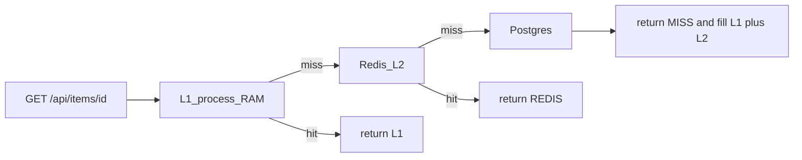

# Caching

**Status:** Implemented  
**Kind:** Core concept  
**Sources:** [Hello Interview — Core concepts](https://www.hellointerview.com/learn/system-design/in-a-hurry/core-concepts) · Alex Xu Vol 1 (caching in web architecture / URL shortener)  
**Slug:** `caching`

This folder is a **concept lab**, not a product interview. Original notes from the 2026-09-20 session.

## What this is

A cache is a **fast copy** of hot data so the **source of truth** (usually the DB) is not on every read. It solves **read latency and DB load when the same keys repeat**. It does **not** fix a slow unindexed query, write throughput, disk capacity, or cross-continent RTT (that is CDN / multi-region).

## Variants to know

| Variant | What it is | When it wins | When to skip |
| --- | --- | --- | --- |
| No cache | Every read hits the DB | Low QPS, write-heavy, or correctness > speed (money, seats) | Read-heavy hot keys; you will melt the primary |
| Cache-aside (lazy) | **Read:** L1/Redis → on miss load DB and fill cache. **Write:** DB first, then delete or skip cache (do not rely on a stale copy) | Interview default for read-heavy APIs | Data that changes every request (cache would only add hops) |
| Write-through | Write DB **and** cache in the same request | Next read must hit; you can pay write latency | High write QPS; Redis down should not fail the write (shortener: ignore Redis on create) |
| Write-back (write-behind) | Write cache first; **async** flush to DB | Spiky writes, loss of a few seconds of data is OK | Anything durable (orders, payments). Cache crash **loses writes** |
| TTL | Key disappears after N seconds; next read refills | Bound staleness when you cannot invalidate every writer | Strong freshness; TTL alone can still serve stale until expiry |
| Invalidate-on-write | On update, `DEL` the key (or overwrite) | Known write path; readers should see new data soon | Many keys derived from one write (fan-out deletes). Combine with TTL as a safety net |
| Stampede / singleflight | Many concurrent **misses** of one key; without coalescing, N DB loads. Singleflight: one loader, waiters share the result | Hot key + expiry or cold cache (Reddit) | Low QPS; one miss is cheap |
| L1 in-process vs Redis L2 | L1 = memory of **this** process (fastest, not shared). Redis = shared across boxes | L1 for ultra-hot keys on one replica; Redis so replica B sees what A filled | L1-only with many app boxes (each stampedes Redis/DB). Redis-only if one box and tiny QPS |
| CDN | Edge cache **near the user** (static, sometimes GET HTTP) | Images, JS, maybe 302s | Row-level app data in your region — that is Redis, not CloudFront. Full lab: `key-technologies/cdn` |

## Lookup sequence

This lab’s **API read** is one chain. CDN is **not** a hop in it.



A **CDN** sits **in front of HTTP**, closer to the browser, for cacheable responses (JS, images, sometimes a public GET). Typical full picture:

`browser → CDN (optional, static/public GET) → app → L1 → Redis → Postgres`

Not: `L1 → Redis → CDN → Postgres`. The CDN does not hold `item:42` for the app to query after Redis misses. Hello Interview / Alex Xu treat CDN as edge HTTP cache, not another KV in front of the DB.

**We do not add a fake CDN to this GET handler.** That would teach the wrong order. CDN demo: `key-technologies/cdn`.

## Interview default

**Cache-aside Redis** on the read path, **TTL + invalidate-on-write**, **singleflight** (and L1) if a key can go viral. Propose cache **after** you have a read-QPS / hot-key story — not as the first box on the diagram. Switch to write-through if the next click must hit; never write-back for money. Point at CDN for static, not for `user:42`.

## Pitfalls

- Caching data that changes on every request (extra latency, no hit rate).
- Treating miss + DB down as **404** (you do not know if the key exists) — use **503**.
- “Cache fills quick” is **not** singleflight: the first millisecond of a hot miss is a herd.
- Redis down: reads fall through to DB (protect it); writes should still succeed.
- L1 is per process: more app replicas ≠ shared L1.
- Putting CDN **between** Redis and the DB on an API lookup. CDN is edge HTTP, not L3 for `item:42`.

## Local demo

FastAPI + Postgres (source of truth) + Redis L2 + in-process L1. **GET** is cache-aside (L1 → Redis → Postgres) with singleflight on miss. **PUT** writes Postgres then deletes the cache key. Response header `X-Cache: L1 | REDIS | MISS`. `/stats` shows how many times Postgres was loaded.

**Cut vs production:** one app replica, no CDN, no write-through/write-back modes, no Redis cluster.

## How to run

Leave the stack **up** while you click through the UI. `stop.sh` is for when you are done, not before opening the browser.

```bash
cd core-concepts/caching
./scripts/setup.sh
./scripts/run-scenarios.sh
./scripts/run-functional.sh
```

Open **http://localhost:8000** (setup must have printed `Caching lab is up`):

1. **Fetch** — `cache=MISS`.
2. **Fetch** again — `cache=L1`.
3. Change the body, **Save**, **Fetch** — `cache=MISS` and the new text.
4. Fetch once more, **Drop L1 only**, **Fetch** — `cache=REDIS`. Next Fetch is `L1` again.

Then stop: `./scripts/stop.sh`. If the page does not load, the containers are down — run `setup.sh` again (do not run `stop.sh` first).

## Session notes

**2026-09-20**

**Q: What problem does a cache solve, and what does it not fix?**  
A: Hot **reads** vs a slower source of truth (latency + DB load). Not writes, not “this query needs an index,” not durable storage, not NY–London RTT.

**Q: Variants (user), then taught**  
A: Write-through / write-back / TTL / L1 vs Redis were in the right direction. Cache-aside is **also the read path** (miss → DB → fill), not “writes skip cache” only. CDN is edge-near-user, not “put the file somewhere and load later” as a generic store. Stampede = concurrent misses of one key; singleflight = one DB load, waiters share. Interview default: cache-aside Redis + TTL + invalidate + singleflight when hot.

**Q: Any remaining questions?**  
A: Session continued 2026-09-26 (UI + L1 code).

**Q: Where is the L1 hit when the second Fetch shows cache=L1?**  
A: `core-concepts/caching/src/main.py`: dict `_l1`, `l1_get`/`l1_set`. `get_item` returns `cache="L1"` if `l1_get` hits before Redis. First miss fills L1 in `cache_fill` → `l1_set`.

**Q: Do we test L2, and when do we use it?**  
A: Yes now: `test_l2_hit_after_l1_dropped` — miss fills L1+Redis, `POST /api/flush-l1`, next GET is `REDIS`. L2 is for keys this process does not have in L1: other replicas, process restart, L1 LRU eviction. Same box + warm L1 never reaches Redis.

**Q: Does this app test CDN?**  
A: No. Tests cover L1, Redis L2, Postgres miss, invalidate, singleflight. CDN is out of this lab (`key-technologies/cdn`, still Stub).

**Q: Wrap up?**  
A: User fully understands. Session closed 2026-09-26. `./scripts/stop.sh` ran.
