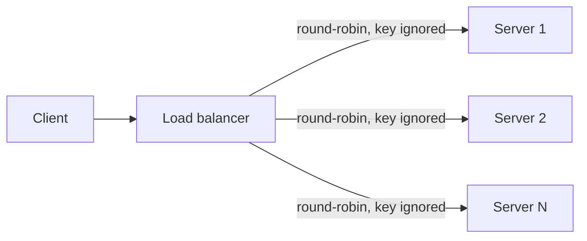
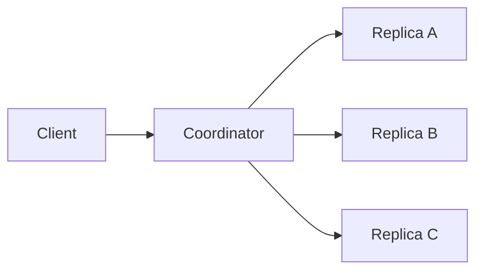
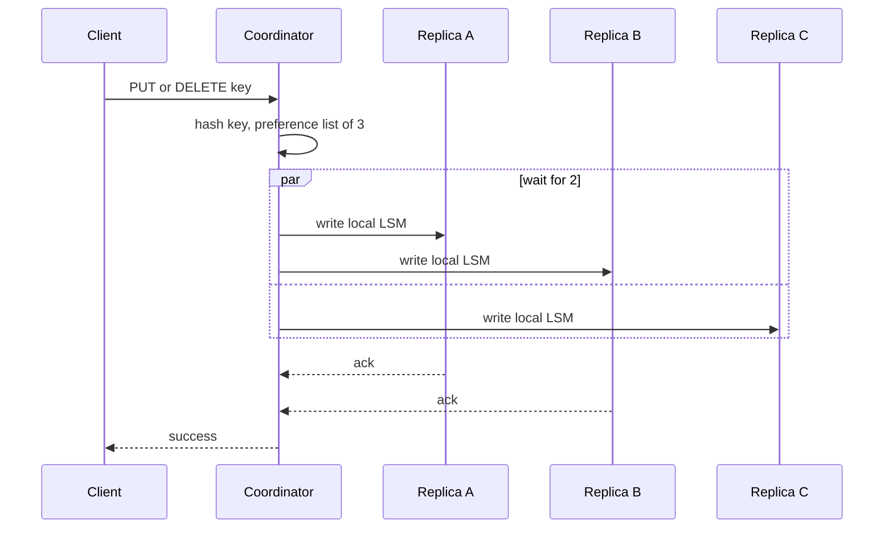
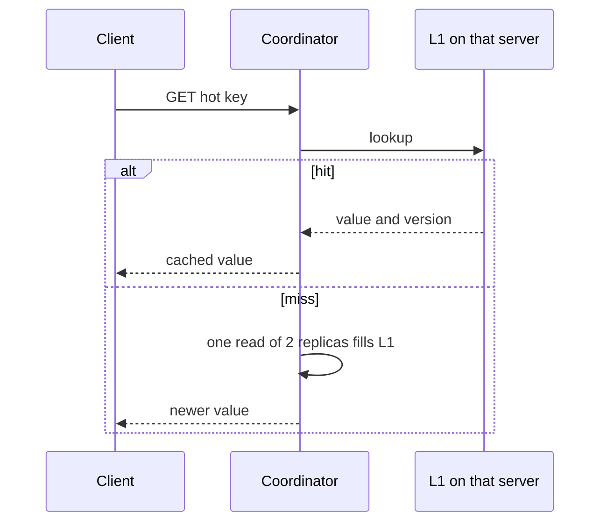
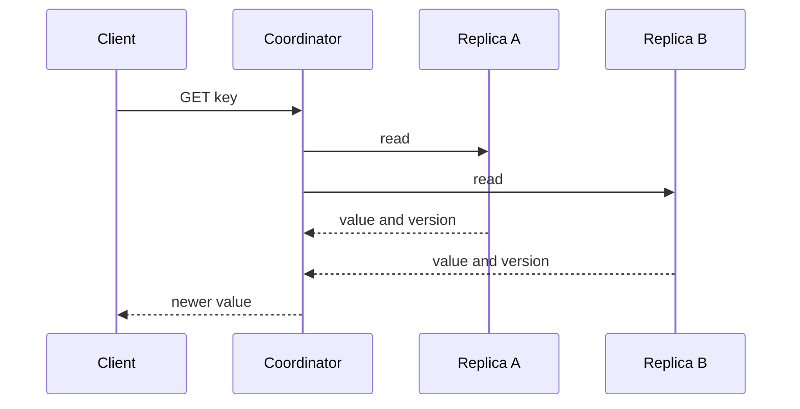

# System flow — Key-Value Store

Original notes from the 2026-09-28 session. The coordinator is any server the client can reach. The key’s copies are three neighbors on the ring.

## Who accepts the call

The server that received the call hashes the key and becomes the coordinator. Every server can do that hash. A gateway that picked the three replicas itself is not in this path.

## Happy path

## Write path

Put and delete use the same path. Delete stores a tombstone instead of a value. Success is 2 acknowledgements out of 3.

## Read path

Get asks 2 of the 3 replicas and returns the newer value, unless this coordinator already has the key in its L1 map. If one replica is down, the other two still answer.

On a miss, that one fill reads two replicas and returns the newer version:

## Failure path

One replica down: put and get still succeed on the remaining pair. The coordinator does not wait for a slow third replica past a timeout; that timeout is for one call, and the server stays on the ring until timeouts repeat. Two replicas down or two timeouts: the coordinator returns an error rather than acknowledging a write that has only one copy. A tombstone that never reaches a replica lets that replica put the old value back during a later repair. The whole region down: every copy is unreachable, and 2-of-3 does not apply.
