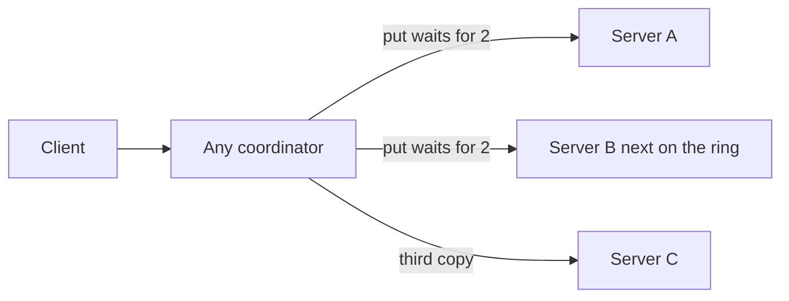

# Key-Value Store

**Status:** Implemented  
**Sources:** Hello Interview (Distributed Cache); Alex Xu Vol 1 Ch 6  
**Slug:** `key-value-store`

Practice in the five-step interview pattern. Keep notes original; link to Hello Interview / cite Alex Xu instead of copying write-ups.

## 1. Requirements and design scope

### Problem

A durable key-value store shared by many app servers. A client puts a value under a key and later gets it back after one storage server has died. The Redis cache from the caching chapter can sit in front. This question is the store itself (Alex Xu Vol 1 Ch 6). Hello Interview’s distributed cache is the ephemeral cousin: there, losing a key on eviction or crash is acceptable.

### Functional requirements

- `put(key, value)`, `get(key)`, `delete(key)`
- Value is a small blob, about 1 KB. A multi-megabyte object belongs in an object store, with the key holding the pointer.
- Lookup is by key only

### Non-functional requirements

The user’s first numbers describe a small product: 100k DAU and 1M operations/day. A day is about 10^5 seconds, so that is about **12 QPS average** and under **100 QPS** at peak. One server handles that. We say so, then use interview numbers that make partitioning and replication necessary.

| | Locked for this interview |
| --- | --- |
| Keys | 200 million |
| Value | 1 KB average → about 200 GB of primary data |
| Copies | 3 → about 600 GB across the cluster |
| Peak | 80,000 gets/s, 20,000 puts/s |
| Latency | Same region. p99 of get or put under 20 ms. The user’s “under 100 ms” is the outer bound; a cross-ocean round trip is already 80–150 ms, so the user-facing call stays in one region |
| Failure | A put that returned success is still readable after one server dies. A get in the same region sees that put |

### Scope

- **In:** put, get, delete by key; place keys on servers; keep copies so one dead server does not drop the key
- **Out:** search by value, transactions across keys, a query language, multi-megabyte blobs, cross-region strong reads

### Core entities

| Entity | Description |
| --- | --- |
| Key | The only lookup handle |
| Value | The blob stored under that key, about 1 KB |
| Server | One machine that owns a slice of the keys and a copy of some other slices |

### APIs

```
PUT    /v1/keys/{key}     body: value
GET    /v1/keys/{key}
DELETE /v1/keys/{key}
```

## 2. High-level design

The client talks to any server. A load balancer picks that server without looking at the key, round-robin across healthy machines. The server that accepted the HTTP call is the coordinator for that call. Every server already has the ring membership, so it hashes the key and picks a **preference list**: that server and the next two clockwise. The coordinator does not have to be one of those three. Those three servers each store the pair in a local LSM engine (the write path from the indexing chapter). There is no single Postgres primary for every key.

A put returns success after **2 of the 3** copies are stored. The third copy can finish after the response. A get asks **2 of the 3** and returns the newer value. One dead server still leaves a pair that can answer. Delete writes a **tombstone** through the same two-copy rule, so a server that was down cannot later restore the key.



Why not one Postgres primary: 20,000 puts/s and 80,000 gets/s land on that one machine, and its death takes every key with it until failover. Copying the entire database to “other machines” repeats the whole 200 GB on every box. The ring stores each key on three servers only.

## 3. Low-level design and deep dive

### Data model

On each replica the record is `(key, value, version, tombstone)`. `version` is a timestamp from the coordinator, so two copies can be ordered. A tombstone is a record with an empty value and a newer version. The key’s three owners come from the ring, not from a table of assignments in Postgres.

Postgres on each ring server is a real alternative, and it is not “three databases instead of the LSM.” The cluster is about 15 servers. Each key still lives on three of them. Swapping the engine means each of those servers runs Postgres for its own slice. A settled point read is often one B-tree descent, which can beat an LSM that still has the key in several SSTables. At about 10,000 gets/s per server both finish well under 20 ms, and the get already waits for two replicas, so the network hop dominates. A full SQL server for one primary-key table also brings connections, planning, and vacuum. This interview keeps the LSM.

### Deep dives

1. **Put on one server.** The write is appended to a write-ahead log and inserted into the memtable. The replica acknowledges only after that log is on disk. A later flush turns the memtable into an SSTable. Acknowledging from RAM alone loses the put on a crash, which breaks the step-1 rule. A replica read checks the memtable, then each SSTable from newest to oldest. A bloom filter on each SSTable says “this key is definitely absent,” so that file is skipped. A “maybe” still uses the sparse index and may read the file. The coordinator’s L1 sits in front of this path. A hot-key hit never opens an SSTable.
2. **Two copies disagree.** Get already asked 2 of 3. It returns the **newer version**, including when one server is dead and the two survivors differ. That difference is usually lag: one copy has the new put, the other still has the previous one. Returning an error in that case fails the get that replication was meant to save. Two different values with the **same** version are a real conflict. This interview uses last-write-wins on the timestamp. A vector clock, which hands both values back to the client, is the alternative when two writers must not silently overwrite each other.
3. **Add a server.** Consistent hashing moves only the arc the new server takes. The previous owner streams that key range to the new server. The other keys stay put. A background compare of the two copies (a Merkle tree is the usual tool) finds any key the stream missed.

## 4. Component questions and special situations

### Specific components

What happens if this piece fails, is slow, or is wrong? Point at [COMPONENTS.md](COMPONENTS.md).

- **Slow replica:** The coordinator sends the put or get to all three in parallel and returns when two have answered. A timeout skips the straggler for that request. One slow reply does not remove the server from the ring. Repeated timeouts are what the failure detector treats as dead. If two of the three miss the timeout, the call errors. That is the same rule as two replicas down.

### Special situations

- **10× gets (80,000/s → 800,000/s), puts stay 20,000/s:** Add servers on the ring. Each new server takes one arc and also accepts client calls, so coordinator capacity grows with the data servers. Leave the LSM, the three copies, and the 2-of-3 quorum alone. At 15 servers the read share is about 100,000 replica-reads/s each (800,000 × 2 / 15). More servers bring that back down. A separate coordinator tier does not hold keys, so it does not absorb those reads.
- **Hot key:** Adding servers does not move one key. Half of 80,000 gets/s is 40,000 reads of the same three replicas. A Redis entry for that key, filled by one read and invalidated on put, takes those gets off the LSM. One Redis is about 100,000 simple ops/s, so it covers 40,000 and does not cover half of the 10× load (400,000/s). At 400,000 gets/s the cache is an L1 map inside each server that accepts API calls: key to value and version. The load balancer spreads the HTTP calls across servers. Each server answers from its own map. The first get on that server misses, one in-flight read fills the map from two replicas, and later gets on that same server do not touch the replicas. A put still hashes and writes the three owners. The coordinator and each replica that applied the write set their own L1 to the new version. Every other server keeps its old L1 until the one-second TTL. This map is not the LSM memtable. The memtable is the durable write buffer on a replica. Uniform 10× reads, where every key got busier, are handled by more ring servers. The L1 is the hot-key lever.
- **Load balancer at 800,000 gets/s:** It forwards each client call once. 800,000 responses of 1 KB are about 6.4 Gbps, inside one 10 Gbps balancer. It does not hash and it does not see the replica fan-out. L1 hits still travel back through it. A second balancer behind DNS is the step when that bandwidth fills.
- **Whole region down:** All three copies live in the one region, so 2-of-3 has nobody left to ack. The client cannot put or get. A second region is future work. A quorum that crosses regions spends 80–150 ms on the round trip and misses the 20 ms budget.

## 5. Summary and future improvements

- **What we designed:** A load balancer hands each call to the next healthy server. That server is the coordinator. A put or delete hashes the key, writes the three owners, and returns when two write-ahead logs are on disk. The record is `(key, value, version)` or a tombstone with a newer version. The coordinator and every owner that applied the write set their own L1 to that version. A get on a server whose L1 is still inside the one-second TTL returns from that server alone. A miss reads two owners and stores the newer version in that coordinator’s L1.
- **Main tradeoffs:** Two acknowledgements instead of three keeps a put alive when one replica is slow. The one-second L1 TTL lets servers that missed the write serve the previous value, and it avoids a broadcast on every put. The LSM appends the put. One region keeps the get under 20 ms.
- **Risks left on the table:** A get can return the previous value for about a second when it lands on a server that did not see the put. That is the common case. The whole region is still a full outage, because all three copies sit there. A tombstone that never reaches the third replica can let a repair copy the old value back. Two writers with the same version collapse to last-write-wins.
- **With more time:** A durable expiry on the key itself, stored and replicated like the value, so a session key disappears without a client delete. That is separate from the one-second L1 timer. A second region for the outage above. A vector clock when both concurrent puts must be shown to the client. Leave the ring, the 2-of-3 quorum, and the LSM in place.

## Local implementation

Five servers (A–E) in one process. Each has a write-ahead log and a memtable on a Docker volume, and its own L1 map with a one-second TTL. The page at http://localhost:8000 is the client. Round-robin is the default coordinator. The server dropdown forces a call onto A or E so the stale L1 is visible.

- **Who coordinated.** The log names the server that accepted the call, the key’s point on the ring, and the three owners. A get that hits L1 says the ring was not used.
- **Hot key.** The first get on a server is a miss and names the two owners it read. The next get on that same server is a hit. A put sets the new version on the coordinator and on the owners that applied it. A server that missed the put still shows the old value in its L1 until the TTL.
- **Cut.** One process pretends to be the load balancer and all five servers. There is no separate Postgres and no real network timeout. The third replica is skipped only when “Leave the third replica behind” is checked. Per-key expiry, a second region, and vector clocks are not in the app. Each SSTable has a bloom filter. A miss names files the filter skipped. “Show a bloom skip” writes enough keys to flush two files, then reads an older key.

- Setup: `./scripts/setup.sh`
- Integration: `./scripts/run-scenarios.sh` — put/get, L1 hit, stale outsider, one owner down, two owners down, tombstone, eight parallel puts
- Functional: `./scripts/run-functional.sh` — the page and the put/get calls it makes

## Session notes

**2026-09-28**

**Q: put/get/delete, 100k DAU and 1M ops/day, under 100 ms, keep the key when a server dies, skip search / cross-key transactions / a query language?**  
A (user): those operations; that scale; low latency; unsure whether a dead server should keep the key for a while; those three items out of scope.

Taught: the API and the out-of-scope list are right. 1M ops/day is about 12 QPS, so one server is enough and a ring has nothing to do. For this interview we use 200 million keys, 1 KB values, 80k gets/s and 20k puts/s, three copies, one region, p99 under 20 ms. “Keep it for a while” is replication: a successful put is still readable after one server dies. A time-to-live cache is the earlier caching chapter.

**Q: Put goes to a primary and a local Postgres, then we copy to other machines. Get hits any server, or another if that one is down. Delete only marks the key.**  
A (user): that path.

Taught: one cluster-wide Postgres sees all 20k puts/s and dies as a single primary. The coordinator can be any server; the bytes live on the key’s three ring neighbors, each in a local LSM. Put waits for 2 of 3. Get asks 2 of 3. A tombstone has to reach the copies, or a server that missed the delete writes the key back.

**Q: Memory first on put? Two of three copies, and invalid if those two disagree? New servers take keys by consistent hashing?**  
A (user): memory first, not certain. Two results to decide; if the only two available copies disagree, return invalid. Adding a server moves keys by consistent hashing.

Taught: memory first is the memtable, and the ack waits for the write-ahead log, not for RAM alone. A disagreement between two live copies is normal lag: return the newer version. Invalid is the wrong result while one server is down. Same version, different value: last-write-wins here. Adding a server moves one arc; the previous owner streams that range.

**Q: Once two servers acknowledge a put, do we delete the WAL?**  
A: No. The log is local to each replica. It stays until that replica flushes its memtable to an SSTable. The quorum ack only means two replicas have the record in their own logs.

**Q: Confirm: ack once the WAL has the record, delete that WAL only after the matching SSTable flush, and on disagreement return the later version.**  
A (user): that is the understanding to check.

Taught: yes. One replica’s ack means key, value, and version are in its log on disk, so a process crash does not drop them. The client’s success is two such acks. Get returns the higher version.

**Q: What stores the key, value, and version? LSM or Postgres?**  
A: The LSM on each replica. The value sits in the memtable and then in the SSTable, beside the key and the version. There is no separate Postgres table holding the blob.

**Q: Why not Postgres, and what does Alex Xu store the record in?**  
A (user): asking which engine the book uses.

Taught: Vol 1 Ch 6’s write path is a commit log, a memory table, and an SSTable, the Dynamo/Cassandra LSM. Postgres per node is a viable B-tree at a few thousand writes per second and is not the path in that chapter.

**Q: Does Hello Interview have a similar chapter?**  
A: Their guided problem is Distributed Cache (in memory, TTL, LRU, loss on restart is acceptable). The durable log-and-SSTable store is Alex Xu Vol 1 Ch 6. Both use a ring and put/get/delete.

**Q: Is the LSM there because one server must do 20k ops/s, and Postgres cannot?**  
A (user): that is the suspected reason.

Taught: 20k puts/s is the cluster. One shared Postgres sees all of them and is the design that fails. Spread on the ring, one server writes about 4k/s (20k puts × 3 copies / ~15 servers). Postgres can do that. The LSM still wins on each replica because the write is an append, not a random B-tree leaf update, and that is Alex Xu Ch 6.

**Q: Is Postgres on each of the three replicas overkill, and would gets be faster?**  
A (user): three Postgres databases in place of the LSM; suspects gets would be faster.

Taught: the three copies stay either way. The ring is about 15 servers, so the swap is Postgres on every server, not three databases for the cluster. A point get on a B-tree is often one lookup and can beat an LSM that has not compacted yet. Both are fast enough at ~10k gets/s per box, and quorum latency is the slower of two replicas. We keep the LSM because the put is an append and because a SQL server is a lot of machinery for one key table.

**Q: 10× gets — add coordinators and servers? Hot key — Redis on the get path? Slow replica — treat as dead? Region down — still up if two servers ack?**  
A (user): that plan.

Taught: add ring servers for spread-out 10× reads. Coordinator-only boxes do not hold the bytes. One hot key stays on three replicas no matter how many servers you add; cache it, and use many app-local copies once that key exceeds about 100,000 gets/s. A slow replica is skipped after a timeout for that call, and marked dead only after repeated timeouts. Two misses and the call errors. Region loss takes all three copies, so 2-of-3 does not keep the store up.

**Q: Can any server coordinate? Do we need a gateway that hashes the key and picks the three replicas? If any server can hash, which server is the coordinator? Is the 400,000 gets/s cache an L1 inside each server? Show both in the local app.**  
A (user): those three questions, plus the demo requirement.

Taught: a load balancer picks any healthy server without hashing the key. That server is the coordinator and it owns the hash. A gateway that routes to the three owners would pile the hot key’s connections onto those three machines. The 400,000 gets/s cache is a process-local map on each server that accepts calls, separate from the memtable. The local page will show the coordinator id, the three replicas, and L1 hit versus replica read.

**Q: Put goes to the load balancer, which picks a coordinator, which hashes the key and stores the pair on the three ring servers?**  
A (user): checking that sequence.

Taught: yes. Round-robin picks the coordinator without the key. That server hashes, sends `(key, value, version)` to the three owners, and each owner acks after its own log is on disk. Success is two acks. The coordinator stores a durable copy only if the ring also named it as a replica.

**Q: At high traffic, does the load balancer become a hotspot and slow the app?**  
A (user): asking whether the front door saturates.

Taught: one L4 balancer is enough here. It sees each client call once, about 6.4 Gbps at 800,000 gets/s of 1 KB, and it does not do the quorum fan-out. L1 hits still return through it. Several balancers behind DNS are the next step when that pipe fills. A smart client that picks a server from the ring removes the balancer from the data path.

**Q: What is the L1 stale-read explanation about? TTL, broadcast, or always reading replicas.**  
A (user): the three choices were unclear.

Taught: L1 maps are private. A put updates two replicas and clears only the coordinator’s map, so another server can still return the old value. TTL bounds that window to about a second. Broadcast clears every map and fans out one message per server. A replica read on every get is fresh and cancels the cache. We keep the TTL. The durable quorum is unchanged.

**Q: Does the coordinator’s own L1 answer a get with no ring hash? Do only replicas B, C, and D cache the key? On a hit, is quorum skipped so one server answers?**  
A (user): checking the get path.

Taught: any server that accepted the get can hold the L1 entry, owner or not. A live entry returns immediately from that process. A miss hashes, reads two owners, and fills this process’s map. Steady hot-key gets are one server. Puts always hash and write the three owners.

**Q: Hot-key gets stop at the coordinator for 10× reads, and put/delete stay on the ring? Does a put clear B, C, and D, while coordinator A keeps the old L1 until TTL?**  
A (user): that reading of the put.

Taught: the coordinator stop is the hot-key read path. Spread-out 10× reads add ring servers. Put and delete always hash and write the three owners. The coordinator updates its own L1 to the new version as soon as two replicas ack, including when the coordinator is A. B, C, and D update their own L1 because the write was applied there. Any other server keeps the previous value until the one-second TTL.

**Q: Put coordinated by A, owners B, C, D: A–D update L1, and E does not?**  
A (user): checking that set.

Taught: yes. A updates on success. Each owner updates its own map when it applies the write. The slower third owner can update after the client response. E keeps the old value until the TTL.

**Q: Put goes load balancer to coordinator to three owners, L1 TTL 1s. Get returns from L1 or else reads the ring and fills L1. Delete is a tombstone. Risk is a stale value within 1s. Later, optional expiry on the key.**  
A (user): that summary.

Taught: the path is right. Success is two of three logs. A tombstone carries a newer version. The one-second stale read is the everyday risk. Region loss is the outage we accepted. Durable per-key expiry is a later feature, replicated like the value, and it is a different timer from the L1. The local page shows the coordinator, the three owners, an L1 hit, and a server that still has the old value.

**2026-09-29 close.** The page was exercised (put through A, get miss on B). No further questions. Stack stopped with `./scripts/stop.sh`. Start again with `./scripts/setup.sh`.

**Q: Do we add a bloom filter to speed up reads?**  
A (user): asking whether the read path needs one.

Taught: yes, on each replica, one filter per SSTable. A quorum read checks the memtable, then asks each filter before opening a file. “Absent” skips the file. “Maybe” can be wrong and still costs a read. The coordinator L1 stays in front, so a hot-key hit never reaches the filter. The lab now flushes a 256-bit filter with each SSTable. The page’s “Show a bloom skip” reads an older key and names the file that was skipped.

**Q: Is the bloom filter on the coordinator, on each server, or both? Does the write path update it, and can the app show that?**  
A (user): expecting the write path to update the filter, and asking where the demo is.

Taught: one filter per SSTable on the server that stores that file. A coordinator uses those filters only when it is also one of the owners being read. A put updates the log and the memtable. The filter is filled at flush and then left immutable. “Show a bloom skip” is the demo.

**Q: The filter is created when the memtable flushes, and every server uses it to skip a key that is not in the store?**  
A (user): checking both halves.

Taught: the flush creates that file’s filter, and the filter is not edited later. Each server filters only its own SSTables. Absent skips that one file. The key may still be in the memtable, in another file, or on another replica.

**Q: A get of a deleted key returns a tombstone, none, or a special keyword?**  
A (user): choosing among those three.

Taught: the caller receives not found and no value. Replicas keep a tombstone with a newer version so repair cannot copy the old value back. The lab also sets `tombstone: true` on the JSON. The value itself is empty.

**Q: Why can’t delete just remove the key and store nothing?**  
A (user): the repair story was unclear.

Taught: erasing leaves no record, so a replica that missed the delete still holds the old value and repair copies it back. A tombstone is a newer version with an empty value. Repair copies that version onto the late replica. The caller still sees not found. The tombstone has to remain until that late replica has seen it.

**Q: A key missing from the SSTables is still in the memtable? Does a bloom-only read miss it, or is the memtable checked first?**  
A (user): asking which check comes first.

Taught: keys written after the last flush exist only in the memtable, and no filter lists them yet. A bloom-only read would report them missing. This design checks the memtable first, then each file’s filter.

**Q: The filter is not updated on the put. That is the point to keep.**  
A (user): that sentence is the one that landed.

Taught: locked. A put updates the log and the memtable only. The filter for a file is created at flush, then left unchanged. The memtable is why a read still finds a key that no filter lists yet.

**2026-09-29 close, continued.** Bloom filter, tombstone repair, and memtable-before-filter are understood. No further questions. Stack stopped with `./scripts/stop.sh`.

## Interview checklist

- [x] 1. Requirements, numbers, and scope stated out loud
- [x] 2. High-level design that actually works end-to-end
- [x] 3. Low-level / deep dive with tradeoffs
- [x] 4. Component probes and special situations (traffic, rush hour)
- [x] 5. Summary and future improvements
- [ ] FAQ practiced out loud
