# System flow — News Feed

The happy path uses fan-out on read. Each chart runs from the client to the load balancer, the gateway, the service, and the database. Schemas are in [final-design-flow.md](final-design-flow.md).

## Overview

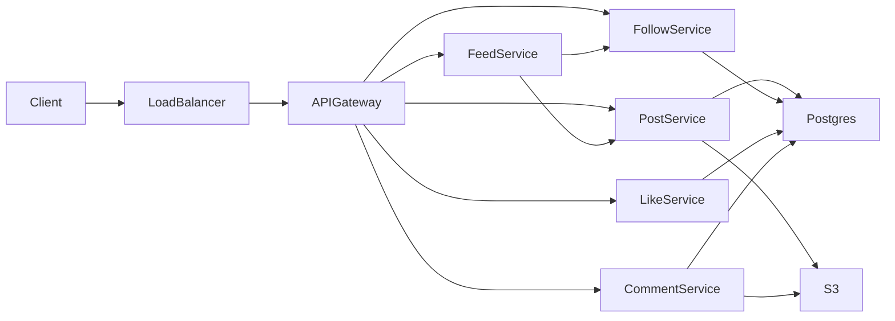

## Create a post

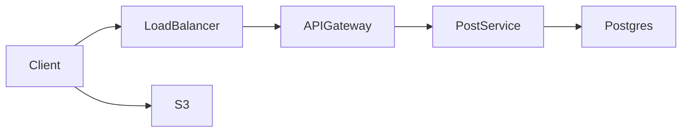

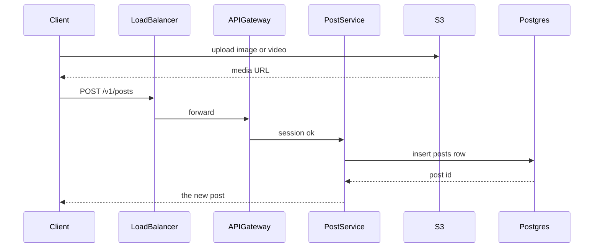

## Follow

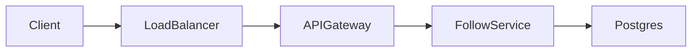

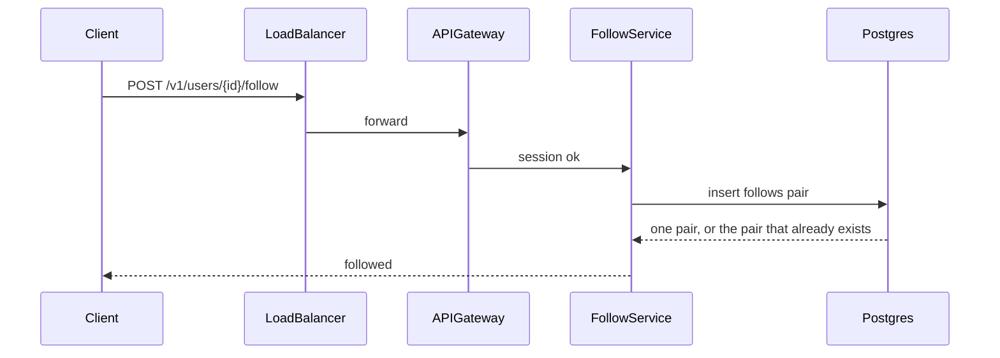

## Home feed and page

The first page omits the cursor. The next page sends the time and the id of the last post. Feed service calls Follow service, then Post service.

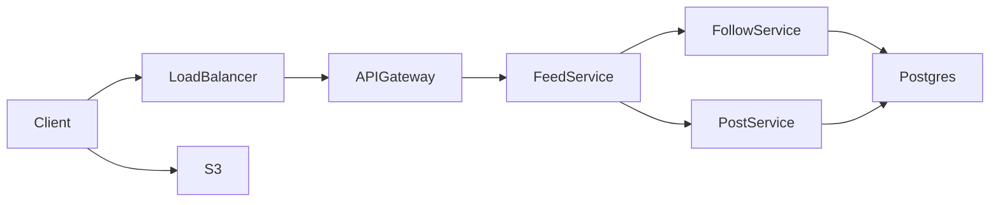

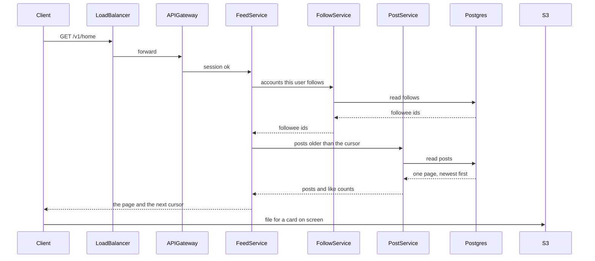

## Like

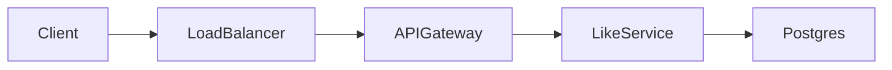

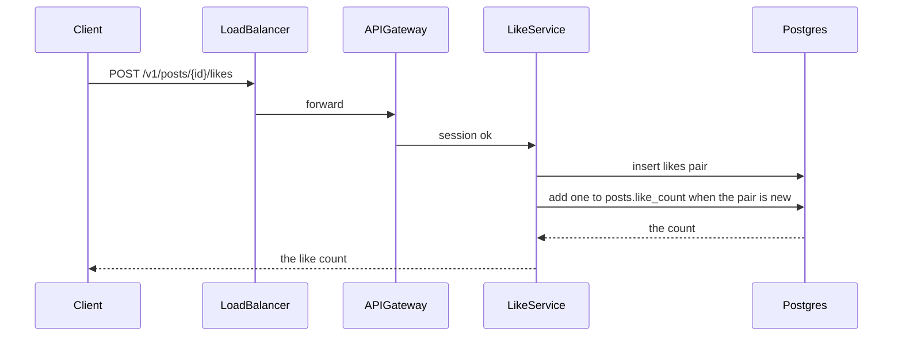

## Comment

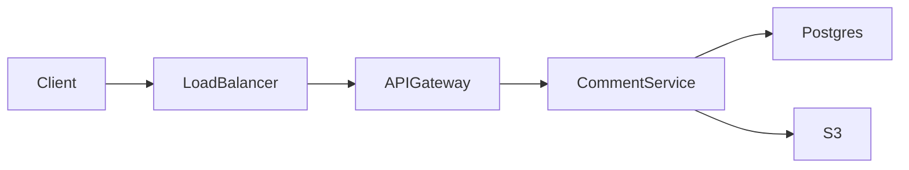

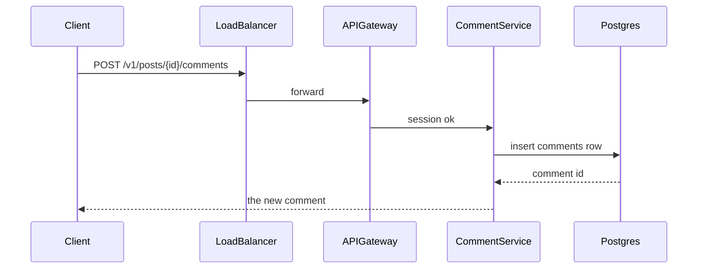

The home card shows the like count. The comment thread is a separate page. That page uses the same road: client, load balancer, gateway, Comment service, Postgres.

## Hybrid path at 5,000 reads per second

Lee follows Kim, a normal account, and Bea, a famous account. A famous account has more than 10,000 followers.

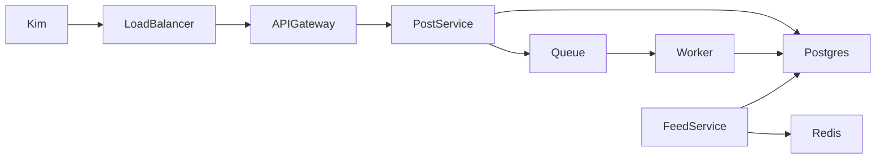

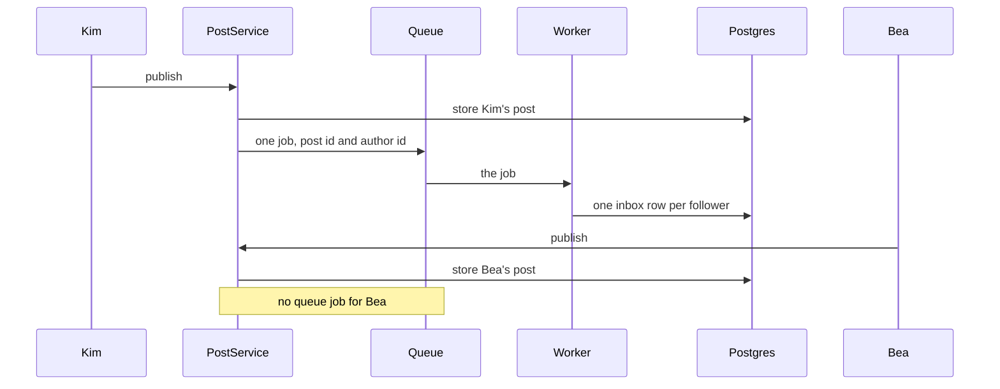

Lee opens home. Feed service reads the precomputed inbox ids, then the recent posts of famous accounts Lee follows. It asks Post service for those post rows and sorts by time.

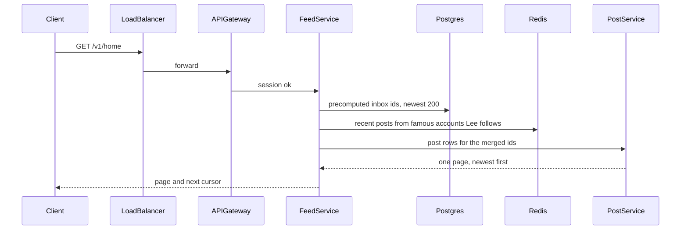

## Failure / overload path

A late merge is acceptable for a follower. The author still sees their own row on the next home load. A failed media upload does not block a text post. A second like from the same user returns the first row.

At about 1,700 likes per second on one post, Like service writes the pair to Postgres and the count to Redis. A worker copies the Redis number back about once a second.

At 5,000 home reads per second, the worker has already copied each normal post into the follower inbox. Each inbox keeps the newest 200 post ids. Feed service loads that inbox and merges famous accounts, above 10,000 followers. A page older than those 200 ids loads normal accounts with fan-out on read.

Five million posts in one day is about 58 writes per second. Those posts stay on one posts table. A month partition is for a disk near 2 TB. The inbox shards by reader id when that table fills.
