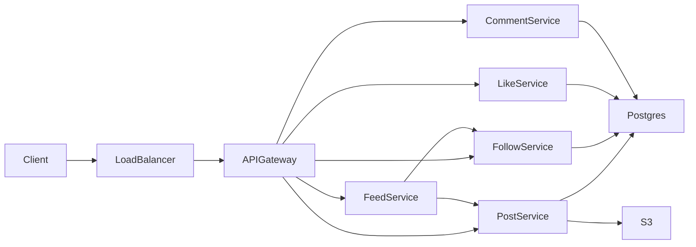

# News Feed

**Status:** Implemented  
**Sources:** Hello Interview (FB News Feed); Alex Xu Vol 1 Ch 11  
**Slug:** `news-feed`  
**Final picture:** [final-design-flow.md](final-design-flow.md)

Practice in the five-step interview pattern. Keep notes original; link to Hello Interview / cite Alex Xu instead of copying write-ups.

## 1. Requirements and design scope

### Problem

Design a social news feed: publish posts, follow users, and load a personalized timeline at low latency.

### Functional requirements

The feed, the follow, and the page come from the Hello Interview prompt. This session adds a like, a comment, and a media file on the post.

- [x] A user can create a post. The body is text. The post can also hold an image or a video.
- [x] A user can follow another account. Follow is one direction. The other person does not have to follow back.
- [x] A user can view a feed of posts from people they follow. The order is reverse chronological. The newest post is first.
- [x] A user can page through that feed. The next page continues after the last post they already saw.
- [x] A user can like a post. A second like from the same user does not add a second row.
- [x] A user can comment on a post. Comments are a list under that post, newest first, and that list has its own page.

The author is included in the feed, so their own new post is on the next load.

### Non-functional requirements

- [x] 1 million daily active users. About 200,000 new posts per day. Home reads are about 200 per second at the peak of a normal day.
- [x] The author sees their post immediately. A follower may see it a few seconds later.
- [x] A page is stable. A new post at the top does not duplicate a row the user already saw, and it does not skip a row.
- [x] The home screen still opens if one followee is slow to appear.
- [x] A like row is durable. The count on the card can lag by a moment.
- [x] The feed card still loads if the media file is slow. The text and the link stay on the post row.

### Scope

- **In:** a text post, an image or a video on that post, a one-way follow, a reverse-chronological home feed, paging, a like, and a comment.
- **Out (this interview):** reposts, search, chat, analytics, a ranking model, and video transcoding. We put likes, comments, and media back on the path after a shorter pass. Transcoding stays with the YouTube question. The post stores the original file.

### Numbers we locked

| Input | Value | What it produces |
| --- | --- | --- |
| Daily active users | 1 million | The user base for this interview |
| Publishers | 10 percent of those users | 100,000 people publish on a given day |
| Posts per publisher | 2 | 200,000 posts per day, about 2 writes per second |
| Home opens per user | 10 per day | About 120 reads per second on average, about 200 at a normal peak |
| Follows per user | 50 | A full copy of every post would be about 10 million deliveries per day |

5,000 home reads per second is the rush-hour probe in step 4. It is about 25 times the normal peak. 5 million posts per day is the follow-up for a popular product. That rate is 25 times the locked write rate. The happy path stays at 200,000 posts per day. We size the popular case only after that path works.

### Core entities

| Entity | Description |
| --- | --- |
| User | The account that publishes and follows |
| Follow | One row from a follower to the account they follow |
| Post | Text, the author, the time, and optional media links. Newest time sorts first. |
| Media file | Image or video bytes in object storage. The post row keeps the link. |
| Like | One user and one post. The pair is unique. |
| Comment | Text on one post, from one user, with its own time |

### APIs

```
POST   /v1/posts
POST   /v1/users/{id}/follow
GET    /v1/home?limit=20
GET    /v1/home?limit=20&cursor={created_at, post_id}
POST   /v1/posts/{id}/likes
POST   /v1/posts/{id}/comments
GET    /v1/posts/{id}/comments?limit=20&cursor={created_at, comment_id}
```

A **cursor** is a bookmark for the next page. It stores the time and the id of the last item on this page. Offset paging counts rows to skip. A new item at the top shifts that count, so a row can repeat or disappear. The cursor asks for items older than the bookmark. The home feed and the comment list each keep their own cursor.

The client uploads the image or the video to object storage first. `POST /v1/posts` then stores the text and the media link.

## 2. High-level design

The study comparison is in [high-level-design-comparision.md](high-level-design-comparision.md). It compares the database, the high-level path, and each feature: post, follow, like, comment, and home feed.

Every call shares the same front door. The client sends the call to a load balancer. The load balancer picks one gateway. The gateway checks the login session and routes to Post, Follow, Like, Comment, or Feed. Those services hold no feed state. They share Postgres. S3 holds image bytes and video bytes. The local lab can keep the link and skip a real bucket. One process can host all five services at this rate. The boxes stay separate so each feature can scale alone.



A hot like count, a 5,000-read peak, and a 5 million post day stay in step 4. The headings below are the happy path, at about 200 home reads per second.

### Create a post

1. The client uploads the image or the video to S3, when the post has a file.
2. S3 returns a link.
3. The client calls `POST /v1/posts` with the text and the links.
4. The API inserts one post row in Postgres.
5. The API returns the new post id.

| Where the file lives | What happens | When it wins |
| --- | --- | --- |
| S3, link on the post row | Postgres stores a short row. The phone loads the file from the link. | This interview. A video is large. About 2 post writes per second. |
| Bytes inside the post row | One store holds the text and the file. | The file is tiny. |
| A transcoding worker | A worker builds smaller copies. | Playback on many screens is the product. That work stays with the YouTube question. |

### Follow

1. The client calls `POST /v1/users/{id}/follow`.
2. The API inserts one pair: this user, and the account they follow.
3. A second follow for the same pair changes nothing.
4. The other person does not have to follow back.

| Follow store | What happens | When it wins |
| --- | --- | --- |
| One pair in Postgres | The home query loads about 50 followee ids. | This interview. The feed only needs that list. |
| A graph database | The same pair, plus multi-hop queries. | The product asks for friends of friends. |
| No follow row | The user opens one profile at a time. | There is no home screen. |

### Home feed

**Fan-out on read** means the home request does the merge. **Fan-out on write** means publish copies the post onto each follower's screen.

1. The client calls `GET /v1/home`.
2. The API loads the accounts this user follows.
3. The API adds this user's own id, so their new post is on the next load.
4. The API loads recent posts for those authors.
5. The API sorts by time. The newest post is first.
6. The card includes the like count. The phone loads a media link when the card is on screen.

| Home-screen choice | What happens | When it wins |
| --- | --- | --- |
| Fan-out on read | Each home load merges posts from about 50 accounts. | This interview. 200 reads per second and a short follow list fit one Postgres query. A quiet follower costs no write. |
| Fan-out on write | Publish copies the post to each follower. Home reads one list. | Followers must see the post from a prebuilt list, or the reader follows thousands of accounts. |
| Hybrid | Normal accounts copy on write. A famous account is merged on read. | Step 4. The home peak is 5,000 reads per second. |
| Profile only | The user opens one author at a time. | There is no home screen. |

### Page the feed

1. The first page omits the cursor. The API returns the newest posts, up to the limit.
2. The response includes a cursor. The cursor stores the time and the id of the last post on this page.
3. The next call sends that cursor. The API returns posts older than the cursor.
4. A new post at the top does not shift this page.

| Page style | What happens | When it wins |
| --- | --- | --- |
| Cursor | The next page starts after the last post on this page. | This feed. New posts arrive at the top while the user scrolls. |
| Offset | The server skips a count of rows. | The list does not gain rows at the top during the scroll. |

### Like

1. The client calls `POST /v1/posts/{id}/likes`.
2. The API inserts one pair: this user and this post.
3. A second tap from the same user finds that pair. The count stays the same.
4. The API adds one to the count on the post when the pair is new.
5. The API returns the count.

| Like record | What happens | When it wins |
| --- | --- | --- |
| A unique pair, plus a count on the post | The card shows the number. A second tap does not add a like. | This happy path. Likes are spread across many posts. |
| A count only | The card shows a number. Both taps add one. | The product never asks who liked the post. |

One post at about 1,700 likes per second is step 4. Redis holds that count there.

### Comment

1. The client calls `POST /v1/posts/{id}/comments` with the text and any media links.
2. The API inserts one comment row under that post, from this user.
3. The home feed does not copy the comment.
4. `GET /v1/posts/{id}/comments` returns one page. That list uses its own cursor.

| Comment place | What happens | When it wins |
| --- | --- | --- |
| One row under the post | The home card stays a post list. The thread is a separate read. | This interview. A comment is rarer than a home open. |
| A copy on every follower's feed | Every follower stores the comment. | Every follower must see the comment without opening the post. |

## 3. Low-level design and deep dive

### Data model

Postgres holds the rows. S3 holds the image bytes and the video bytes. A link list on the post, and a link list on the comment, point at those files.

A **follow** row is one direction, from the reader to the account they follow. The home query needs this table. A user row and a post row cannot name the 50 accounts.

| Table | Key columns | Why this row exists |
| --- | --- | --- |
| users | id, user_name, email, created_at, updated_at | The account. Email is unique. The feed does not read updated_at. |
| follows | follower_id, followee_id, created_at | Who this user follows. Primary key is the pair. |
| posts | id, user_id, content, image_links, video_links, like_count, created_at | One post. The link lists are empty when the post is text only. |
| likes | user_id, post_id, created_at | One like. Primary key is the pair, so a second tap does not add a row. |
| comments | id, post_id, user_id, content, image_links, video_links, created_at | One comment under one post, from one user. |

`image_links` and `video_links` are text arrays. Each value is an S3 link. A child media table wins later, when you must find every post that uses one file.

The home index is `(user_id, created_at, id)` on posts. The comment index is `(post_id, created_at, id)`.

The home cursor is `(created_at, post id)`. The comment cursor is `(created_at, comment id)`. The query asks for rows older than that pair, newest first, with a limit.

The author of a comment is `user_id`. The original post is `post_id`.

### Where the like count lives

The pair in `likes` is the source of truth. `posts.like_count` is the number on the card. The API inserts the pair and adds one to the count in one Postgres transaction.

A DynamoDB item of `(post_id, like_count, updated_at)` is a later store for one hot post. The local stand-in is Redis. The pair still lives in Postgres, so the second tap stays one like. A count with no pair cannot tell those two taps apart.

| Like store | What it keeps | When it wins |
| --- | --- | --- |
| Postgres pair, plus a count on the post | Who liked, and the number on the card | This interview. The like rate fits one database. |
| DynamoDB count only | The number for one post id | The card needs a fast number, and "you liked this" is out of scope. |
| DynamoDB pair and count | Who liked, and a fast number | One post receives likes faster than one Postgres row can take. |

### Deep dives

1. **The follow list is the home query.** The API loads followee ids for this user, adds the user's own id, and reads posts with `user_id` in that set. The index starts with `user_id`, then time. Fifty accounts at 200 reads per second is one query. A reader who follows thousands of accounts makes that `IN` list expensive. That case is fan-out on write, or a hybrid, from step 2.

2. **A second like.** Two taps from the same user hit the same primary key. The second insert does not add a row, and the count stays the same. A DynamoDB item that stores only `like_count` increments on both taps. The pair is what makes the like match the requirement.

3. **The comment is not a feed copy.** A comment insert writes one row under `post_id`. The home page does not merge comments. The comment page uses its own cursor. A new comment at the top does not shift the feed page.

4. **The file and the row can disagree.** The client uploads to S3, then the API inserts the post. A failed insert leaves an unused file. A cleanup job can delete it later. A failed upload still allows a text post. The feed returns the link. The phone loads the bytes when the card is on screen.

## 4. Component questions and special situations

The happy path stays fan-out on read, with the like pair and the like count in Postgres. The three shocks below add Redis, a hybrid inbox, or a shard. A **shard** is one slice of a table on its own machine. The **shard key** is the column that picks the slice.

### A post that gets likes much faster than the others

Story: 100,000 people like one post in one minute. That is about 1,700 likes per second. Each like updates the same `posts.like_count` row. Postgres runs those updates one after another.

The pair insert is a different row per user. That insert can stay on Postgres. The hot spot is the single count.

**Write-back** means Redis takes the new count now, and a worker copies that number to Postgres later.

| Count path | What happens | When it wins |
| --- | --- | --- |
| Update `like_count` in the same transaction | The card matches the pair. One row takes every like. | The happy path. Likes are spread across many posts. |
| Redis increment, write-back every second | The card reads Redis. Postgres receives one count write per second. | This shock. One post takes about 1,700 likes per second. |
| Redis only, no pair | The count is fast. A crash deletes the likes. A second tap can add another count. | The product allows a lost like. |

Choice: insert the pair in Postgres first. If that pair already exists, do not increment. Otherwise increment Redis. A worker writes the Redis number onto `posts.like_count` every second. If Redis dies, `COUNT` on the pair table rebuilds the number. The lost window is about one second of card lag, and the pairs are still there.

### Home peak of 5,000 reads per second

Yes. At this peak we change the home path to hybrid. The normal peak is 200 reads per second. This peak is 5,000. Ten times the normal peak is about 2,000, and it uses the same hybrid.

An **inbox** is the list already stored for one reader. It holds post ids and times. It does not hold the post text. This session stores that list as rows in Postgres, keyed by the reader id. A **famous account** has more than 10,000 followers.

Lee follows 49 normal accounts and one famous account, Bea.

**Write, normal account.** Kim publishes. Kim has 50 followers, and Lee is one of them. The API stores Kim's post. A worker then writes one inbox row for each follower. Lee's inbox now contains Kim's post. The API does not do those 50 copies inside the publish call.

A **message queue** is one shared line of work. Kim's publish adds one job: the post id and Kim's user id. A worker takes that job, loads Kim's followers, and writes the post id into each follower's inbox. Lee has an inbox. A private queue per reader would still be fan-out on write, because the copy happens when Kim publishes. Fan-out on read stores the post once and merges on Lee's open.

The worker must run before the peak, so the inbox is already full when 5,000 people open the app.

**Write, famous account.** Bea publishes. Bea has more than 10,000 followers. The API stores Bea's post and stops. The worker does not copy that post into Lee's inbox. A copy would be one row per follower.

The skip is per author. Hello Interview stores that mark on the follow row, so one edge can skip precompute. This session stores `famous` on the user row. Every follower of Bea is skipped for the same reason: one publish would write too many inbox rows. A reader who follows Kim and Bea still gets both. Kim's post is already in the inbox. Bea's post is merged when that reader opens home.

**Read.** Lee opens home. The API loads Lee's inbox. That list already has the normal accounts, including Kim. The API also loads Bea's recent posts. It merges the two lists by time. The newest post is first. The page cursor still marks the last post Lee saw.

**Inbox size.** The worker keeps the newest 200 inbox rows for one reader. A newer row pushes the oldest row out. Each row is a post id and a time. The post text stays in `posts`. The first pages come from those 200 rows, plus Bea's posts. A page older than the oldest inbox row loads normal accounts with fan-out on read. Bea's posts still merge on every page. A famous account is an author with more than 10,000 followers. That limit sits on the author. The 200 limit sits on one reader's list.

About 200,000 posts a day, times about 50 followers, is about 10 million inbox rows a day. One million readers times 200 rows is 200 million rows. That count stays flat.

| Home path | Write | Read | When it wins |
| --- | --- | --- | --- |
| Fan-out on read | Store the post once. | Merge all 50 accounts at read time. | The happy path. About 200 reads per second. |
| Fan-out on write for every account | Copy the post to every follower, including Bea's fans. | Read Lee's inbox only. | Followers must see every post from a prebuilt list, and no account has millions of fans. |
| Hybrid | Copy normal accounts into each follower's inbox. Leave Bea as one post row. | Read Lee's inbox, then merge Bea's posts. | This peak. The read is one list plus a few famous accounts. |
| Hybrid, newest 200 ids | Same copy. Drop inbox rows older than the newest 200 for that reader. | Recent pages read the inbox. Older pages use fan-out on read for normal accounts. Famous accounts still merge on every page. | This peak, so one reader does not keep every post id forever. |
| Redis page for Lee only | The write path stays fan-out on read. | Return Lee's last merged page if it is still fresh. | Lee refreshes within about 10 seconds. A one-time open by 5,000 different people misses. |

Redis can also store Bea's recent posts. Every follower of Bea shares that one list during the merge.

**One account with 1 million followers.** That account is famous. The publish inserts one post row and does not enter the queue. There are no 1 million inbox writes. The remaining load is read load. Each home open needs Bea's recent ids. Those readers share one Redis list, `recent:{author_id}`. Feed service then loads the post row by id. A **Post Cache** is a copy of that row, key `post:{post_id}`, with the text and the links. Posts change rarely, so each entry can live for a long time. The cache drops the least recently used rows when it is full. Add it when one post row is read harder than one Postgres primary can serve. Use several cache nodes, and let every node store any post, including the same hot post. A load balancer spreads the reads. A sharded cache would keep that post on one node, and the hot read would still hit that node. The first miss on each node can load Postgres once, so N nodes can cause N loads. At 5,000 home reads per second, this interview stops at the shared id list. The hot like count on that post is the Redis counter from the section above.

### Five million posts in one day

Five million posts in one day is a write-rate question and a disk question. It is a different problem from the 5,000 home reads.

The write rate is about 58 new posts per second on average. A peak is a few hundred posts per second. One Postgres primary can store that. Hybrid does not change this post write. Hybrid adds inbox copies for normal accounts.

If we keep every post, and each post is about 1 KB, the posts table grows by about 2 TB in a year. That is the disk question.

A **partition** is a split inside one database, often by month. The database still looks like one table. A **shard** is a split onto another machine. The application picks the machine.

| Choice | Which problem it solves | What Lee's home read does | When it wins |
| --- | --- | --- | --- |
| Keep one posts table, and use the hybrid above | 58 post writes per second | Inbox, then Bea's posts | This follow-up. The write rate fits one machine. |
| Partition the posts table by month | A 2 TB year of old posts | The recent month, plus the inbox | The disk is large. The product can archive an old month. |
| Shard the inbox by Lee's user id | One inbox machine is full | Lee's inbox is on one machine. Bea's posts stay on the posts store. | Many readers make the inbox the big table. |
| Shard the posts table by author id | One posts machine is full | Kim's post is on Kim's machine. Home does not gather 50 authors, because those authors are already in the inbox. | The inbox already exists. Home still uses fan-out on read, so this shard makes one home load call many machines. |

### Specific components

- **Redis dies before write-back.** The card falls back to `posts.like_count` or to a count of the pairs. The worker fills Redis again from those pairs. Likes that only lived in Redis would be gone, so the pair insert stays first.
- **The inbox worker lags.** A follower sees a normal account's post a few seconds late. The author's own row is still on the next load. A famous account is merged at read time, so that post does not wait on the worker.
- **Postgres primary dies.** Promote the replica. Publish pauses until the new primary is up. Home can read the replica for a stale page.
- **S3 is slow.** The feed still returns text and the link. The phone retries the file.
- **One region is lost.** This interview stays in one region. A replica in a second zone covers a zone loss. A full region design is future work.

Point at [COMPONENTS.md](COMPONENTS.md).

## 5. Summary and future improvements

- **What we designed:** One gateway routes to Post, Follow, Like, Comment, and Feed. Postgres holds the rows. S3 holds the files. The happy path is fan-out on read, at about 200 home reads per second. There is no inbox, no queue, and no worker. At 5,000 reads per second, a normal account enters one shared queue. The worker writes inbox rows and keeps the newest 200 ids per reader. A famous account, above 10,000 followers, inserts the post and does not enter the queue. Feed service reads the inbox and merges that author's recent ids from Redis key `recent:{author_id}`. A hot like count uses `like_count:{post_id}`.
- **Main tradeoffs:** Fan-out on read stays cheap at about 200 reads per second and about 50 follows. The hybrid costs inbox rows so the peak read is one list. A famous author avoids a huge inbox write and pays for a shared read of recent ids. Five services make each feature easy to scale, and a home read pays for two service calls.
- **Risks left on the table:** The inbox worker can lag. One hot like count still needs Redis write-back. One viral post row can still hit Postgres. A year of posts can fill one disk.
- **With more time:** A replicated Post Cache, key `post:{post_id}`, when one post row is hotter than one Postgres primary can serve. A rank step. A CDN for the files. A shard of the inbox by reader id.

## What we implemented

The lab runs at http://localhost:8000. You are Lee, Kim, Ada, or Bea. Bea is the famous account.

- Three home columns sit side by side: fan-out on read (the default), fan-out on write, and hybrid.
- Each action names the service and the database. A second like does not add a second count.
- The header lists each store and its rows. A changed row is highlighted after the next action.
- The lab inbox keeps every copied row. It does not drop rows past 200. The 200 limit is in the design notes above.
- Follow buttons are built from the user list. The current user is left off. Bea can follow Lee.
- Postgres stores the rows. Redis stores the like count beside the Postgres count. Image and video links stand in for S3. There is no real bucket.
- One process hosts the five services. The chart still shows them as separate boxes.
- The lab writes inbox rows inside the publish call. It does not run a queue or a worker process. The design picture does. Those two boxes are marked shock in `final-design-flow.md`.

Start: `./scripts/setup.sh`  
Integration: `./scripts/run-scenarios.sh`  
Functional: `./scripts/run-functional.sh`

## Local implementation

- Setup: `./scripts/setup.sh`
- Integration: `./scripts/run-scenarios.sh`
- Functional: `./scripts/run-functional.sh`

## Interview checklist

- [ ] 1. Requirements, numbers, and scope stated out loud
- [ ] 2. High-level design that actually works end-to-end
- [ ] 3. Low-level / deep dive with tradeoffs
- [ ] 4. Component probes and special situations (traffic, rush hour)
- [ ] 5. Summary and future improvements
- [ ] FAQ practiced out loud
