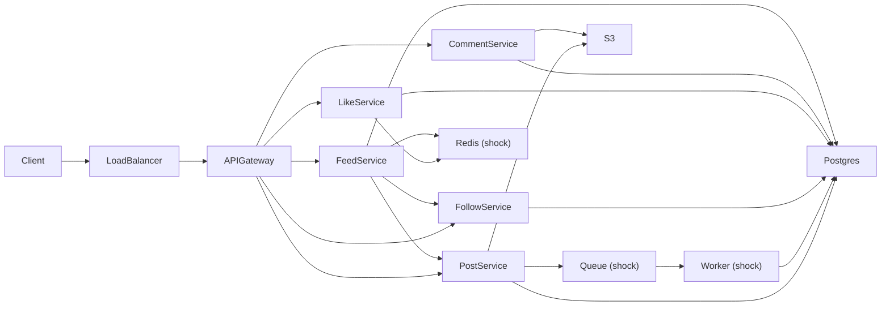
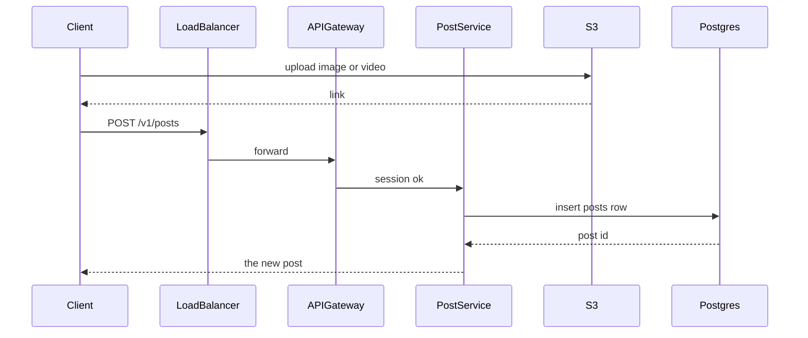
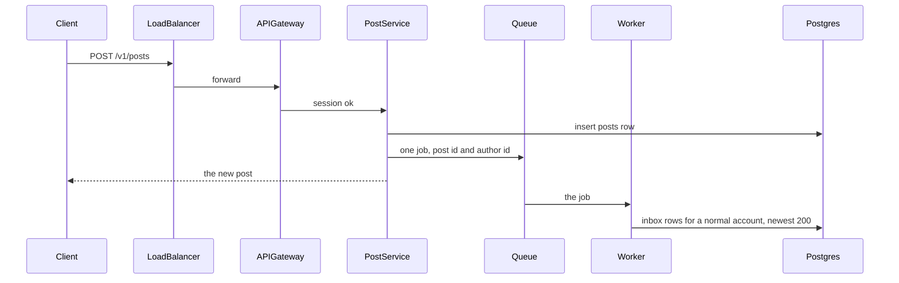
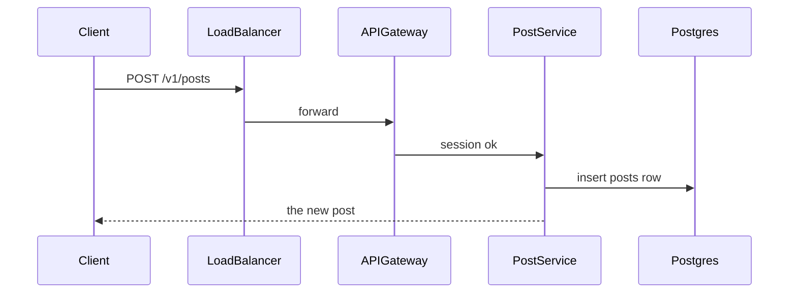
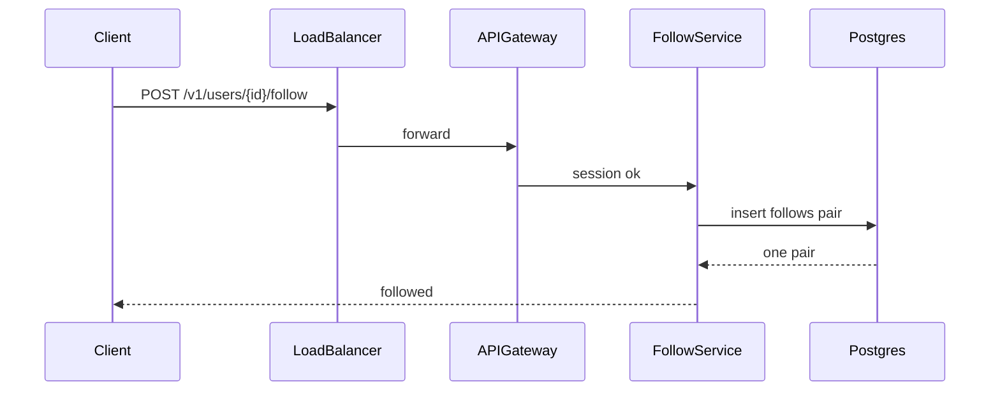
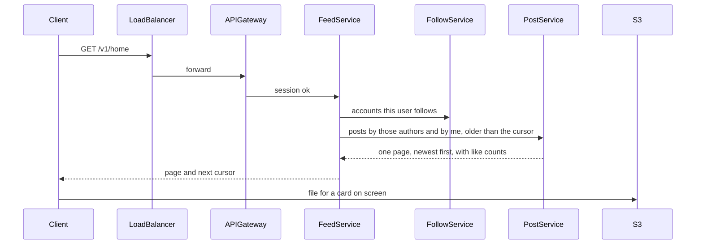
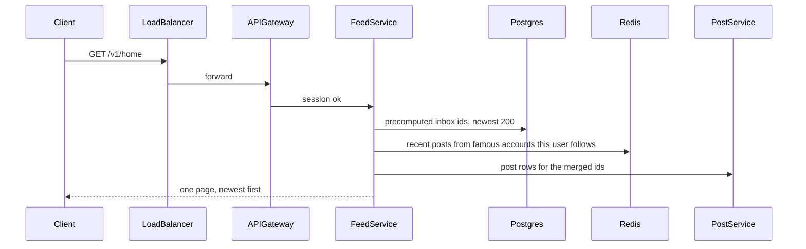
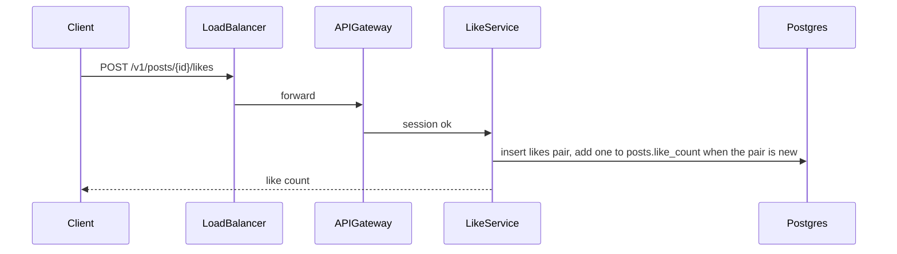
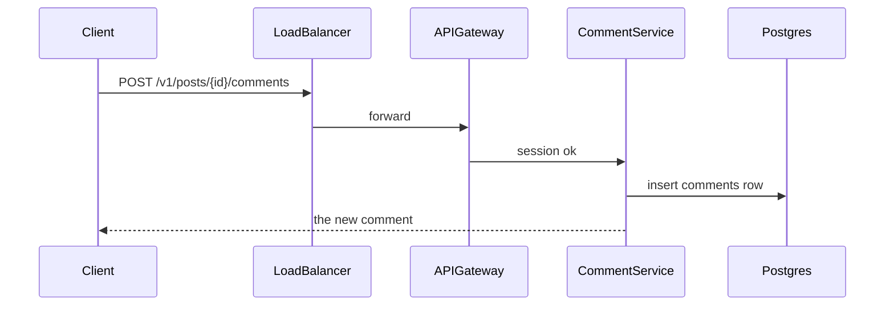

# Final design flow — News Feed

This is the picture after steps 1–4. The interview sequences stay in [FLOW.md](FLOW.md). The box list stays in [COMPONENTS.md](COMPONENTS.md).

The happy path is about 200 home reads per second. Boxes marked **shock** turn on later. Redis turns on for a hot like count. The queue, the worker, and the inbox turn on at 5,000 home reads per second.

The gateway routes each call to the service that owns that feature. One shared process is enough for the rate. The boxes stay separate so each feature can scale on its own, which is the Hello Interview shape. Like and comment are in this session, so those two services are here too.

## The picture

A box marked shock is off on a normal day. At 5,000 home reads per second, Post service writes one job to the shared queue for a normal account. The worker writes inbox rows in Postgres and keeps the newest 200 ids for that reader. A famous account has more than 10,000 followers. That publish inserts the post and does not enter the queue. Like service increments Redis when one post is hot. The same worker copies that count back to Postgres. Feed service reads the inbox, then reads Redis for recent posts from famous accounts this user follows.

## Request paths

### Create a post

At 5,000 home reads per second, a normal account continues into the queue. The job holds the post id and the author id. The worker writes inbox rows and keeps the newest 200 ids for each follower.

A famous account has more than 10,000 followers. Post service still inserts that post. It does not put a job on the queue. The worker never sees that post.

### Follow

### Home feed and page

Happy path, about 200 reads per second:

The first page omits the cursor. The next page sends `(created_at, post id)`.

Shock path, 5,000 reads per second:

### Like

When one post takes about 1,700 likes per second, Like service still inserts the pair in Postgres. It increments Redis. The worker copies that number back to `posts.like_count` about once a second.

### Comment

`GET /v1/posts/{id}/comments` reads that table with cursor `(created_at, comment id)`. The home page does not copy comments.

## Services

| Service | When it runs | What it does |
| --- | --- | --- |
| Client | Always | Uploads a file, then calls the API. Draws the feed. Loads a file when the card is on screen. |
| Load balancer | Always | Sends each call to one healthy gateway. |
| API gateway | Always | Checks the login session. Rejects a call with no session. This interview does not design passwords. |
| Post service | Always | Inserts one post. Owns the `posts` table. Talks to S3 through the link the client already uploaded. On the 5,000-read path, enqueues one inbox job. |
| Follow service | Always | Inserts one follow pair. Owns the `follows` table. Answers "who does this user follow?" |
| Like service | Always | Inserts one like pair. Owns the `likes` table. Updates `posts.like_count`. Increments Redis when that count is hot. |
| Comment service | Always | Inserts one comment. Owns the `comments` table. Pages that list. The home feed does not call it. |
| Feed service | Always | Builds one home page. On the happy path it calls Follow service, then Post service, and sorts. On the 5,000-read path it reads the inbox, merges famous accounts, then calls Post service for the bodies. Owns the `inbox` table. |
| Queue | Shock | One shared line of jobs. Each job is a post id and an author id. A reader does not get a private queue. |
| Worker | Shock | Takes one job. Writes inbox rows for a normal account and keeps the newest 200 ids. Copies a Redis like count back to Postgres. |

## Databases

### Postgres

Type: relational database. One database. Each service owns the tables named above. Feed service reads posts through Post service on the home path.

`users`

| Column | Role |
| --- | --- |
| id | Primary key |
| user_name | Display name |
| email | Unique |
| created_at | When the account was created |
| updated_at | Last profile change. The feed does not read this. |

`follows`

| Column | Role |
| --- | --- |
| follower_id | Who follows. Part of the primary key. |
| followee_id | Who is followed. Part of the primary key. |
| created_at | When the follow started |

Primary key: `(follower_id, followee_id)`.

`posts`

| Column | Role |
| --- | --- |
| id | Primary key |
| user_id | Author |
| content | Text |
| image_links | Text array of S3 links. Empty when there is no image. |
| video_links | Text array of S3 links. Empty when there is no video. |
| like_count | Number on the card |
| created_at | Sort time |

Home index: `(user_id, created_at, id)`.

`likes`

| Column | Role |
| --- | --- |
| user_id | Who liked. Part of the primary key. |
| post_id | Which post. Part of the primary key. |
| created_at | When they liked |

Primary key: `(user_id, post_id)`. A second tap hits this key and does not add a row.

`comments`

| Column | Role |
| --- | --- |
| id | Primary key |
| post_id | The post |
| user_id | The author |
| content | Text |
| image_links | Text array of S3 links |
| video_links | Text array of S3 links |
| created_at | Sort time |

Comment index: `(post_id, created_at, id)`.

`inbox` — shock only, 5,000 home reads per second

| Column | Role |
| --- | --- |
| user_id | The reader. Part of the primary key. |
| post_id | The post id. Part of the primary key. |
| created_at | The post time. Part of the primary key. |

Primary key: `(user_id, created_at, post_id)`. The home read for this path is `user_id = Lee`, newest first. The row does not store the post text. The worker keeps the newest 200 rows for that reader. A page older than the oldest of those rows uses fan-out on read for normal accounts.

### S3

Type: object store. Always on when a post or a comment has a file.

| Field | Role |
| --- | --- |
| object key | One file |
| bytes | The image or the video |

The Postgres row stores the link. The phone reads the bytes from S3.

### Redis — shock only

Type: key-value store, in memory.

| Key | Value | When |
| --- | --- | --- |
| `like_count:{post_id}` | Integer count | One post takes about 1,700 likes per second. The pair stays in Postgres. |
| `recent:{author_id}` | Recent post ids for that author | The 5,000-read merge for a famous account. Followers share this list. |
| `post:{post_id}` | Post text and links | Later. Off in this interview. This is the Post Cache. Several nodes each may store the same post. A load balancer spreads the reads. |

### Queue — shock only

Type: a shared message queue. One queue for every author. A reader does not get a private queue.

| Field | Role |
| --- | --- |
| post_id | The new post |
| author_id | Who published |

One publish adds one job. The worker loads the followers and writes inbox rows.
