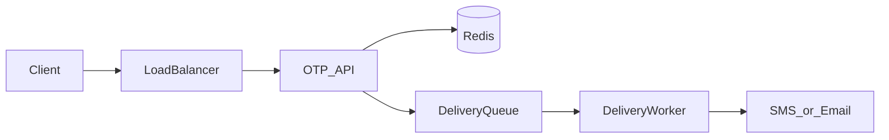
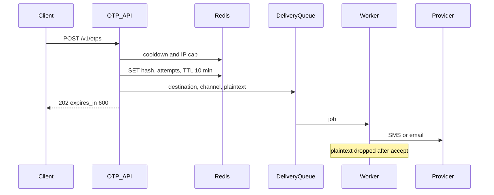
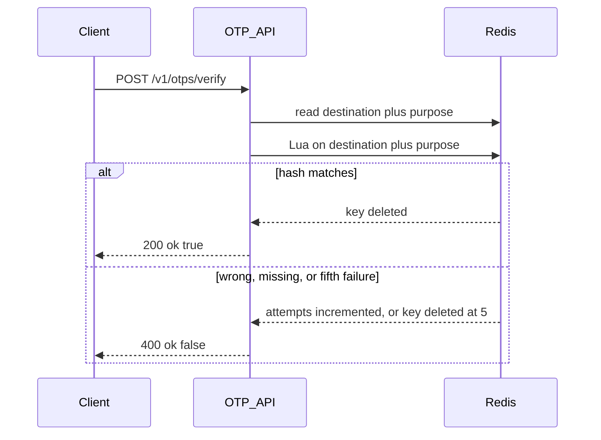

# System flow — One-Time Password

## Happy path

## Generate

The API returns only after Redis has the hash and the queue has accepted the job. A code that was never stored is never sent.

## Verify

Success and failure use the same response shape. The body does not say whether the destination was unknown.

## Failure

- Redis write fails: no queue message, the API returns an error, the client may retry.
- Queue write fails after Redis: delete the new key, return an error, so the cooldown does not trap the user with a code that was never sent.
- Provider fails: the worker retries with backoff. The code remains verifiable until the 10-minute TTL. The user can request another code after the 60-second cooldown.
- Two verifies at once: the delete runs as one Redis operation, so only one caller observes success.
