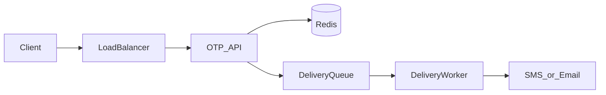

# One-Time Password

**Status:** Implemented  
**Sources:** Common interview prompt (login and payment codes). Related: [Hello Interview Notification System](https://www.hellointerview.com/learn/system-design/problem-breakdowns/notification) · Alex Xu Vol 1 Ch 10 (how the code is delivered). Not a numbered Alex Xu chapter.  
**Slug:** `one-time-password`

Practice in the five-step interview pattern. Keep notes original; link to Hello Interview / cite Alex Xu instead of copying write-ups.

## 1. Requirements and design scope

### Problem

A user is signing in or confirming a payment. They ask for a short code. We send it to a phone or email they already control. They type it back. We say yes or no. The code works once, and only for a short time.

### Functional requirements

- Ask for a code for a destination (phone or email) and a purpose (`login` or `payment`).
- Deliver it on SMS or email.
- A correct code, still inside its lifetime, and not yet used, returns success to the caller.
- **Used** means that success already happened for this code. A second check fails even if the clock has not run out.
- A new code for the same destination and purpose replaces the previous one. The old code stops working.
- Resend cooldown: one new code per destination per 60 seconds.
- Per-IP cap on generate, looser than the per-destination cooldown, so one shared office address is not frozen.
- At most 5 wrong checks per code. After that the code is dead.

### Non-functional requirements

The user’s rate is the number this interview uses.

| | Locked for this interview |
| --- | --- |
| Send | 1,000 codes/s |
| Verify | 1,000 checks/s |
| Code | 6 digits (1,000,000 values) |
| Lifetime | 10 minutes (inside the 10–15 minute range they named) |
| Live set | 1,000/s × 600 s ≈ 600,000 codes in flight. About 100 bytes each ≈ 60 MB. Storage is small. |
| Generate latency | The API returns after the code is stored. Target under 100 ms. The SMS or email is not on that path. |
| Verify latency | A point lookup. Target under 50 ms. |
| Delivery | Seconds, sometimes longer. The carrier is outside our latency budget. |
| Failure | If we cannot store the code, we do not send it. A code already accepted stays accepted. |
| Cost | 1,000 SMS/s is on the order of 86 million messages a day. The bill is the provider, which is why the 60-second cooldown exists. |

Brute force: 5 tries against 1,000,000 values is a tiny chance per code. The 10-minute window is safe because of the attempt cap. Without the cap, 10 minutes is a long guessing window.

### Scope

- **In:** issue, deliver, and check the code, including expiry, single use, resend cooldown, and the guess cap. Store a hash of the code. Return the same error for a wrong code and for an unknown destination.
- **Out:** account registration and the user table, the session cookie, the payment ledger, building an SMS carrier, and a fraud model.

Security of the code stays in. The product is a check that the person holds that phone or inbox. Account storage stays out.

### Options we compared

| Lever | Options | Choice |
| --- | --- | --- |
| Lifetime | 30–60 s (authenticator apps); 2–5 min (SMS in hand); 10–15 min (email, user may switch apps) | 10 minutes, plus the 5-try cap |
| Who we throttle | Do nothing; 1 generate per IP per minute; per destination plus a looser per-IP cap; also cap guesses | Per destination 1 per 60 s, per IP about 10 generates per minute, 5 guesses per code |
| How much security | Cut it all; the properties that make “one time” true; a full risk engine | Expiry, single use, attempt cap, hash at rest, one error message |

### Core entities

| Entity | Description |
| --- | --- |
| Code | Destination, purpose, hash, expiry, attempts left, channel |
| Cooldown | “This destination already got a code in the last 60 seconds” |
| Delivery job | Channel plus destination plus the plaintext code, only long enough to hand to the provider |

### APIs

```
POST /v1/otps
  { "destination": "+1...", "channel": "sms" | "email", "purpose": "login" | "payment" }
  → 202 { "expires_in": 600 }

POST /v1/otps/verify
  { "destination": "+1...", "purpose": "login", "code": "482913" }
  → 200 { "ok": true }  or  400 { "ok": false }
```

`202` means accepted, not delivered. The hash is already in Redis and the job is on the queue. The SMS or email has not arrived. The body is `expires_in: 600` from that moment. The digits are in the message the provider sends. They are not in this response. A `200` would also be a legal status here. We use `202` so the caller does not treat the response as “the user already has the code.”

The hash is written in the API before the enqueue. The worker sends the plaintext from the job and does not write Redis.

## 2. High-level design

The client calls one stateless OTP API behind a load balancer. The URL picks generate or verify. A separate API gateway is optional at 1,000 requests/s: TLS and path routing already live in that API.

The live code sits in Redis under `destination + purpose`. The value is a hash of the 6 digits, plus attempts left. The key expires in 10 minutes. The plaintext exists only in the delivery message until the worker has handed it to the provider.

Generate writes Redis first, then appends a delivery job. The API returns 202 after those two writes. A worker reads the job and calls the SMS or email provider. Verify reads the same Redis key, compares the hash, and deletes the key on success.



### Options we compared

| Lever | Options | Choice |
| --- | --- | --- |
| Edge | Load balancer plus one API; add a gateway product in front | Load balancer plus one API. The gateway does not change generate or verify. |
| Lookup key | `userId + sessionId`; `destination + purpose` | `destination + purpose`. The session is created by the caller after `ok: true`. Login and payment codes stay distinct. |
| Live store | Postgres row with a `used` flag; Redis key with TTL; both, with Postgres as an audit log | Redis. About 600,000 keys and 60 MB. The key’s job is to disappear, and a restart only forces a resend. |
| Send path | gRPC from the API to the provider; queue plus worker | Queue plus worker. Provider time is seconds, and the 202 must return in under 100 ms. |

Postgres still works at this rate if the verify is one transaction (`UPDATE … WHERE used = false`) and a job deletes expired rows. We leave that audit log out of the first drawing. Details are in [FLOW.md](FLOW.md) and [COMPONENTS.md](COMPONENTS.md).

## 3. Low-level design and deep dive

### Data model

One Redis key per destination and purpose. There is no `used` column. A successful check deletes the key. Five failures delete it too. Expiry is the TTL.

| Key | Value | TTL |
| --- | --- | --- |
| `otp:{purpose}:{destination}` | hash of the 6 digits, and `attempts` (wrong guesses so far, starting at 0) | 10 minutes, set when the API writes the hash |
| `otp:cool:{purpose}:{destination}` | `1` | 60 seconds |
| `otp:ip:{ip}` | generate count | 60 seconds |

Verify runs as **one Lua script** on the code key. Redis runs that script to the end before any other command on that key. The API does not `GET`, compare, then `DEL` as three round trips.

### Deep dives

1. **Five attempts.** `attempts` lives in the same key as the hash. The script adds 1 on a mismatch. At 5 it deletes the key. A later guess finds no key and gets the same `ok: false` as a wrong code.
2. **Two overlapping verifies.** Without the script, both requests can read the hash, both decide it matches, and both return `ok: true`. Inside the script the second run sees no key. `WATCH`/`MULTI` can do this with a retry. Lua is one round trip and no retry.
3. **Worker dies after the `202`.** The hash is already in Redis. A redelivery sends the same digits again and does not write Redis. The user can still type the code if a later try reaches the phone before the 10-minute TTL. If no SMS arrives, they request another code after the 60-second cooldown. That new generate replaces the hash.

## 4. Component questions and special situations

### Specific components

- **Redis down.** Generate and verify both return **503**. We do not send an SMS, and we do not answer `ok: false` (that status means “this guess is wrong”). When Redis returns, codes that were lost with it are gone. The user requests a new one. We do not accept a code just because the store is down.
- **SMS provider down, email up.** The API rejects `channel=sms` while the provider is unhealthy, and the UI hides that option. Email still generates. Jobs already queued retry with backoff until that code’s `expires_at`, then the worker drops them. A retry does not mint a new hash. A second SMS provider is later work.

### Special situations

- **10× traffic (10,000 sends/s and 10,000 checks/s):** Add API processes and delivery workers. One Redis primary still holds the live set: 10,000 × 600 s ≈ 6 million keys, on the order of 600 MB. The provider’s send quota is the ceiling. If the queue is deeper than the workers can drain before those codes expire, generate returns 503 instead of accepting texts that will arrive dead.
- **Rush hour:** Same levers. The queue absorbs a short spike. A spike longer than the 10-minute TTL is shed, not buffered forever.
- **Hot destination:** One phone is already limited to one new code per 60 seconds, so that Redis key is not a hot key. The abuse is cost: once a minute all day is still ~1,400 SMS. A daily counter, `otp:day:{destination}`, TTL 24 hours, rejects generate after **10** codes. It does not ban the number after the first message. Verify of a code already sent still runs. One IP spraying many numbers is still the 10-generates-per-minute IP cap. A botnet needs the daily cap per destination.
- **Region or dependency loss:** This interview is one region. Losing Redis is the 503 case above. Losing the SMS provider leaves email.

### Options we compared

| Situation | Options | Choice |
| --- | --- | --- |
| Redis down | Fail open and accept the code; queue the generate and send SMS anyway; fail closed with 503 | 503. No SMS without a stored hash. |
| SMS down | Hide the button only; API rejects sms plus UI hide, retry queued jobs until expiry; second provider | API reject plus UI hide. Retry until `expires_at`. |
| 10× | App servers only; servers plus workers; also a bigger Redis and a second provider | Servers and workers. Redis stays one primary. Shed when the queue outruns the TTL. |
| Hot phone | Do nothing beyond 1 per minute; ban the number for 24 hours after one SMS; 10 codes per destination per 24 hours | 10 per day, on top of 1 per minute. |

## 5. Summary and future improvements

- **What we designed:** The API hashes a 6-digit code into Redis under destination plus purpose, enqueues the plaintext, and returns `202` with `expires_in: 600`. A worker sends SMS or email and does not write Redis. Verify is one Lua script: a match deletes the key, then the API returns `200` `{ "ok": true }`. Five misses delete it too. One generate per destination per 60 seconds, about 10 per IP per minute, 10 per destination per day.
- **Main tradeoffs:** Redis matches a row that must disappear, and the script makes two verifies into one success. Postgres with one transaction and a delete job is the right answer when the company already runs only Postgres and the rate stays near 1,000/s. Matching the existing stack is a real constraint. The defense is still the TTL and the single script, or the transaction if the stack is Postgres. A direct call from the API to the carrier misses the 100 ms budget. The queue keeps that call off the request.
- **Risks left on the table:** A lost `200` burns a correct code. One region. One SMS provider. No audit history.
- **With more time:** An idempotency key so a retry of the same verify can repeat the `200`. A second SMS provider. A Postgres audit of issued / delivered / verified with no digits. Stopping new SMS when the provider or the queue cannot drain inside the 10-minute TTL is already part of this design, not a later idea.

## 6. What we implemented

- **Runs:** A page at `http://localhost:8000` plus `POST /v1/otps` and `POST /v1/otps/verify`. Redis holds the hash. A background thread is the delivery worker. The inbox on the page is the stand-in for the phone or mailbox.
- **Matches the design:** `202` with `expires_in: 600` and no digits. The worker writes the inbox and does not write the code key. Verify is one Lua script, then `200` or `400`. Five misses delete the key. Cooldown 60 seconds, 10 per day, SMS-down returns 503 and email still sends, Redis-down returns 503.
- **Cut (simpler version):** One process instead of a separate worker service. The queue is a Redis list. SMS and email are the inbox, not a carrier. Redis-down is a flag in the process, not a killed container. No Postgres audit, no second provider, no idempotency key. Constant-time compare is a byte loop inside the script.
- **How to run:** `./scripts/setup.sh`, `./scripts/run-scenarios.sh`, `./scripts/run-functional.sh`. Stop with `./scripts/stop.sh`.
- **Tests prove:** Generate omits the code; inbox then one success; a second verify fails; wrong and unknown share `400`; the fifth miss kills the real code; cooldown, daily cap, overlapping verifies (one `200`), SMS down versus email, and Redis down `503`. The page flow does the same generate → inbox → verify path.
- **Session questions:** On success the Lua script deletes the code key, then the API returns `200`. `MULTI`/`EXEC` is Redis’s transaction and cannot branch on a read; the script is the atomic check we run. This service does not create the login session or the payment.

## Local implementation

Running. Open `http://localhost:8000`.

- Setup: `./scripts/setup.sh`
- Integration: `./scripts/run-scenarios.sh`
- Functional: `./scripts/run-functional.sh`
- Stop: `./scripts/stop.sh`

## Interview checklist

- [x] 1. Requirements, numbers, and scope stated out loud
- [x] 2. High-level design that actually works end-to-end
- [x] 3. Low-level / deep dive with tradeoffs
- [x] 4. Component probes and special situations (traffic, rush hour)
- [x] 5. Summary and future improvements
- [x] 6. What we implemented (after tests)
- [x] 7. User questions at the end, recorded in FAQ/README
- [x] 8. Stack stopped with `./scripts/stop.sh`
- [x] FAQ practiced out loud
