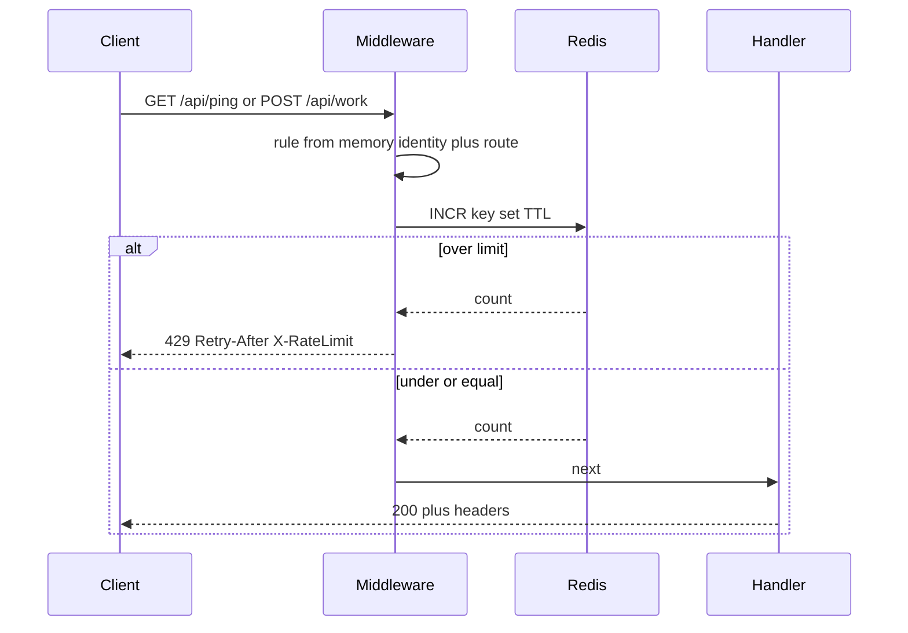
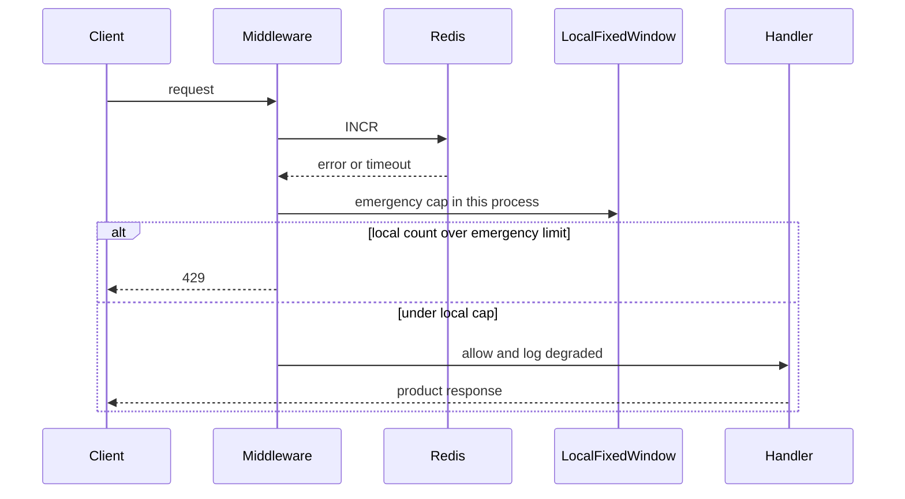

# System flow — Rate Limiter

## Happy path (under the cap)

## Over the cap

## Allow vs 429 (sequence)

## Redis down (degraded, not SQL)

Emergency limit is **smaller than the global rule** (about global/N). Do **not** `SELECT`/`UPDATE` Postgres to decide 429. A dead region uses this path only; a healthy region still uses Redis.
