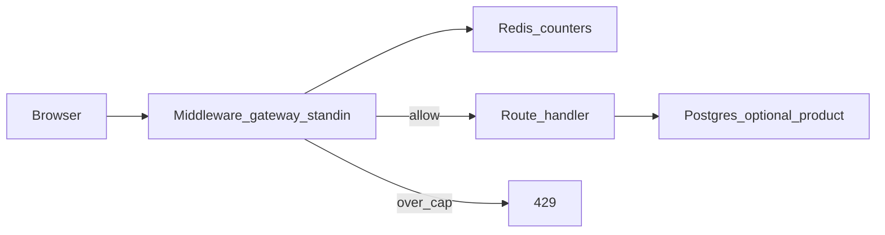

# Rate Limiter

**Status:** Implemented  
**Sources:** Hello Interview; Alex Xu Vol 1 Ch 4  
**Slug:** `rate-limiter`

Practice notes from an interview-style session (2026-09-27). Original notes; not a copy of those write-ups.

## 1. Requirements and design scope

### Problem

A **distributed** limiter on the request path: for each call, decide **allow or reject** so one client cannot drown an API. Rejects are **HTTP 429**. The limiter must be correct enough across **several app boxes** that share one counter store.

### Functional requirements

- [x] **Must:** identify the caller (**IP** for anonymous; optional `X-Client-Id` so we can demo two users behind one NAT)
- [x] **Must:** **per-endpoint** rules (cheap route vs expensive route), not one global cap only
- [x] **Must:** over-limit → **429** plus **`Retry-After`** and **`X-RateLimit-Limit` / `Remaining` / `Reset`** (body alone is not enough)
- [x] **Must:** check runs on **every** request (gateway / middleware), not a separate “please rate-limit me” call the client might skip
- [ ] **Nice-to-have:** paid plans, per-country rules, sliding-window vs token-bucket (algorithm is step 3)

### Non-functional requirements

- [x] **~10k QPS** of checks (same order as the shortener read path). Peak ~3–10× → **30–100k**; one Redis node’s interview ceiling is ~100k ops/s, so **counters live in Redis, not Postgres**
- [x] **p99 of allow/deny: a few milliseconds** (target **&lt; 5 ms**). The check is added to **every** API. A 50 ms limiter makes a 10 ms handler look like 60 ms. Redis INCR in-DC is ~1 ms; Postgres on this path is the wrong store
- [x] **Soft limit:** two boxes racing the same key may go **slightly over** the cap. Exact needs a Lua/lock story (step 3). Soft is the interview default at 10k QPS
- [x] **Fail open** if Redis is down: serve the API, log, optional coarse in-process cap. Fail closed (429 everyone) turns a cache outage into a **product** outage — we do not take that for this API

### Scope

- **In:** per-caller + per-route limits, shared Redis counters, 429 + headers, FastAPI middleware standing in for an API gateway, a small UI to hammer routes
- **Out (this interview):** billing/plans, geo rules, CDN/WAF DDoS, multi-region exact sync, a separate limiter microservice process
- **Deferred:** algorithm bake-off (fixed window vs sliding vs token bucket) until low-level; distributed lock for exact counts

### Options we considered (not only the chosen path)

| Topic | Options | This interview |
| --- | --- | --- |
| Identity | IP vs user id vs API key | **IP default**, optional client id. IP-only fails NAT/mobile/shared office |
| Placement | Library in each app vs gateway vs sidecar | **Gateway conceptually**; local = **middleware + shared Redis** (no extra hop) |
| Overshoot | Exact vs slightly over | **Slightly over** |
| Redis down | Fail closed vs fail open | **Fail open** (user first said closed; we switch so Redis death ≠ site death) |

### Core entities

| Entity | Description |
| --- | --- |
| Rule | `route` → `limit` + `window_seconds` |
| Bucket | Redis key `rl:{identity}:{route}:{window}` → integer count, TTL ≈ window |

### APIs

Limiter is **middleware**, not a public `POST /check`. Demo product routes (different caps):

```
GET   /api/ping          high limit (e.g. 20 / 10s)
POST  /api/work          low limit (e.g. 5 / 10s)
GET   /api/limiter/me    remaining for this identity (UI)
GET   /                  UI
GET   /healthz
```

Allow: `200` + rate-limit headers. Deny: `429` + `Retry-After`.

## 2. High-level design

Updated 2026-09-27.



**Allow:** request hits **middleware** (whiteboard: API gateway). Middleware loads the **rule from process memory** (not Postgres). Redis **`INCR`** on `rl:{identity}:{route}:{window}`: missing key counts as **0**, first `INCR` returns **1**. The **return value is the new count** — compare to `limit` in the app (**one command**). Set **TTL ≈ window** on first increment (`EXPIRE` or pipelined INCR+EXPIRE) or the key never resets. If count ≤ limit → headers → handler. Postgres is **not** on the check path.

**429:** same `INCR`; if count > limit → **do not** call the handler. Return **429** + `Retry-After` + `X-RateLimit-*`. The rejected call still consumed a token (“429s consume quota”). On **one Redis**, `INCR` is atomic: you do **not** get extra **200s** from a race. Soft overshoot still happens from **fail open**, **fixed-window edges**, and later multi-region — not from two INCR commands interleaving.

**Redis down:** **fail open** — skip the check, log, run the handler. We do **not** fall back to Postgres for counters (that would miss p99 and melt the primary). If Redis is down, “database down” does not change the limiter; the API may still 503 on product writes.

**Who owns the counter:** Redis (in-process RAM only if you skip Redis — then cap is **per replica**). **Who owns the rule:** **YAML / env / constants loaded at boot** into the limiter process (not a `SELECT` per request). Postgres is **not** on the check path. You *may* persist rules in Postgres and cache them in memory if product wants a UI to edit limits. **Who owns product rows:** Postgres, after allow (`/api/work` inserts). Local Docker still runs Postgres because this repo’s questions ship a real DB, not because the limiter `INCR`s SQL.

**Not in this picture:** extra limiter RPC, CDN/WAF, reading the counter with GET then later INCR (two hops + TOCTOU).

### Options (HLD)

| Approach | Pros | Cons | When it wins |
| --- | --- | --- | --- |
| GET count, then INCR if under, then forward | Intuitive | Race: two GETs see 9/10, both pass | Never at 10k QPS |
| INCR first, then compare (chosen) | One Redis **RTT** (one network round trip: app → Redis → app). On one Redis, concurrent INCR is **exact** for how many **200s** you allow | 429s still increment (strict “don’t count rejects” needs Lua) | This interview |
| Counters in Postgres | Durable | Misses **&lt;5 ms** p99; ~10k writes/s ceiling | Do not use for checks |
| Fallback to Postgres when Redis down | Still limits during Redis outage | Fail-open becomes fail-to-DB; outage becomes a herd on PG | Skip; fail open instead |

## 3. Low-level design and deep dive

Updated 2026-09-27. Algorithms are original notes (Alex Xu Vol 1 Ch 4 covers the same family; do not paste that chapter).

### Data model

**Rules (process memory, from YAML or constants):** `route → {limit, window_seconds}`. Example: `/api/ping` 20 / 10s, `/api/work` 5 / 10s. Not a per-request SQL read.

**Counter (Redis).** Identity = IP or `X-Client-Id`. No SQL counter. Optional product rows only after allow (`work_events`).

Fixed window / sliding counter share a clock bucket:

```
rl:{algo}:{identity}:{route}:{window_start}  → integer
```

`window_start = floor(now / window_seconds) * window_seconds`. Sliding window counter reads **this** bucket and the **previous** one. Log uses a sorted set of timestamps (no window id). Token / leaky use one key per identity+route (tokens or last-leak time), not a window id.

### Deep dives

1. **Which algorithm** (below). Interview line for the boundary bug: **sliding window counter**. Local lab runs **all five** behind a selector so the difference is visible.
2. **Key + TTL.** Window id in the key resets fixed and sliding-counter buckets. No TTL ⇒ lifetime cap.
3. **Boundary burst.** 10 at `10:00:59` and 10 at `10:01:01` are **20 calls inside one rolling minute**. Fixed window allows both. Sliding counter should 429 the second burst.

### Algorithms

| Algorithm | What it stores | Burst / accuracy | Cost | When it wins |
| --- | --- | --- | --- | --- |
| Fixed window | One integer per clock bucket | Allows **2×** at the boundary (`:59` + `:01`). Does **not** queue or smooth | One `INCR` | Soft limit, 10k QPS, cheapest |
| Sliding window log | Timestamp per request (sorted set) | Exact “N in the last W seconds” | Memory ∝ requests; several Redis cmds | Low QPS, must be exact |
| Sliding window counter | Current bucket + previous bucket, **weighted** | Approximates a rolling window; small error | Two counters + math (often Lua) | Interview answer to the `:59`/`:01` picture |
| Token bucket | Tokens + last refill time | **Allows** a burst up to bucket size, then steady rate. Rejects; does not drip a queue | Lua so refill is atomic | “Burst of 20, then 2/s” |
| Leaky bucket | Queue, leak at constant rate | **Smooths** output (or drops). Adds wait if you queue | Queue memory + latency | Pace calls **to** a slow downstream |

**“Smooth the burst”** is **leaky bucket** (queue/drip). Sliding window counter only **counts more honestly across the clock edge**. Both still **429**; they do not slow the client down by holding the HTTP request.

### “Slide every 10 seconds”

Sliding window counter does **not** jump forward in 10-second steps. The weight moves **every moment**:

`estimate = previous_count × (window − elapsed) / window + current_count`

At 1 second into a new 60s window, previous still counts as ~59/60. At 30 seconds, previous counts as half. A **10-second slide** is a coarser cousin: store 10s buckets and **sum the last 6** for a 60s cap. Integers only; the edge inside one 10s bucket can still double. Our demo routes are already **10-second windows** (20/10s and 5/10s). The same bug is 20 at `t=9.9s` plus 20 at `t=10.1s`.

### Choice

**Say sliding window counter** when the requirement is “N in any window,” because 20 in two seconds fails that. **Ship one algorithm in production.** **Local lab implements all five** (selector on the UI) so fixed vs sliding counter vs log vs token vs leaky can be compared on the same routes. Log stays the exact, heavy one — fine in the lab, not the 10k QPS default.

## 4. Component questions and special situations

Updated 2026-09-27.

### Specific components

- **Redis down:** do **not** 429 the whole site and do **not** use Postgres as the counter. **Degraded mode:** each app replica uses an **in-process fixed window** with an **emergency** limit (about `global_limit / replica_count`, or a small configured cap), and emit a metric. Copying the full global limit into every process means **N × limit** while Redis is dead.
- **Rules:** still the in-memory map. A bad deploy of YAML fails the process at boot, not mid-request.
- **Postgres down:** limiter still decides 200 vs 429. `/api/work` may **503** after allow.

### Special situations

**10× traffic (10k checks/s → 100k checks/s).** The limiter does not absorb growth for free. Every call, allowed or 429, is still one Redis command. One Redis node is about **100k** simple ops/s, so 10× lands on that ceiling.

Say this: add **app replicas** (CPU for the check) and **Redis capacity** when the extra QPS is **many different keys** (a real rush hour). A Redis cluster spreads those keys. Leave Postgres out of the check.

If you add nothing, Redis latency climbs, the check times out, and every app box drops into the **local emergency cap**. The API then sees far more than the global rule.

**One hot user.** Other users are already on other keys (`identity + route + window`). They do not share this counter. Making the key longer (IP + user id + path + window) keeps **one** counter for that same person, so it does not spread their traffic and does not change anyone else’s limit.

Say this: let them **429**. The damage is Redis doing a huge number of `INCR`s on **one** key (one slot, one thread). Put a **small in-process counter in front of Redis** for that key so the millionth request is rejected in the app and never sent to Redis. An edge block (WAF) is the same idea, earlier. A random suffix on the key gives the attacker **N counters**, so their cap becomes N times larger.

**Dead region.** Only apps that **cannot reach Redis** change behavior. They use the **in-process fixed window** (emergency cap ≈ global/N). Apps in the healthy region keep using Redis and the normal rule. Do not 429 the healthy region because the other region’s Redis died. A client who can send traffic into the dead region is limited only by that local emergency cap until Redis there is back.

## 5. Summary and future improvements

- **What we ship:** limiter middleware inside the API, counters in Redis, rules in memory. Production algorithm: **sliding window counter**. The lab UI can switch all five.
- **Tradeoff:** sliding counter spends two keys and a weight to stop the 2× boundary burst. Fixed window is one `INCR` and allows that burst. The log is exact and heavier.
- **Risk:** Redis down → each replica’s smaller fixed-window emergency cap (limit ÷ replica count). A hot user is blocked in-process until the window ends so Redis is not hit on every attack request.
- **With more time:** a longer ban or edge block across windows; Lua that does not count 429s on the fixed window; Redis cluster for many keys.

## 6. What we implemented

- **Runs:** UI at http://localhost:8000, FastAPI, Redis counters, Postgres rows for allowed `POST /api/work` only. Limits come from `src/rules.yaml`, loaded once at process start.
- **Matches the design:** per-route limits, `INCR`-style checks, 429 + `Retry-After` + `X-RateLimit-*`, local block after the cap, local emergency cap when Redis is skipped (`X-Force-Local` in tests; real Redis errors take the same path).
- **Cut:** one app process (emergency cap still divides by 4, as if four replicas). No real multi-region. Leaky bucket returns 429 when full; it does not hold the HTTP connection in a queue. No WAF.
- **How to run:** `./scripts/setup.sh`, then `./scripts/run-scenarios.sh` and `./scripts/run-functional.sh`. Stop with `./scripts/stop.sh`.
- **Tests prove:** work allows 5 then 429; the 429 after that is `local-block`; ping’s limit is higher; fixed window allows 10+10 at the 60s edge; sliding counter denies the second 10; 12 parallel work calls allow exactly 5; forced local emergency cap is 1; the page lists every algorithm; token bucket allows 5 work rows in Postgres.
- **Session questions:** YAML rules at boot, Redis holds each algorithm’s counter, UI examples for all five. Closed 2026-09-27. See FAQ.

## Interview checklist

- [x] 1. Requirements, numbers, and scope stated out loud
- [x] 2. High-level design that actually works end-to-end
- [x] 3. Low-level / deep dive with tradeoffs
- [x] 4. Component probes and special situations (traffic, rush hour)
- [x] 5. Summary and future improvements
- [x] 6. What we implemented (after tests)
- [x] 7. User questions at the end, recorded in FAQ/README
- [x] 8. Stack stopped with `./scripts/stop.sh`
- [ ] FAQ practiced out loud
