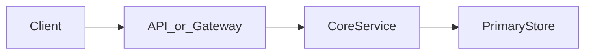
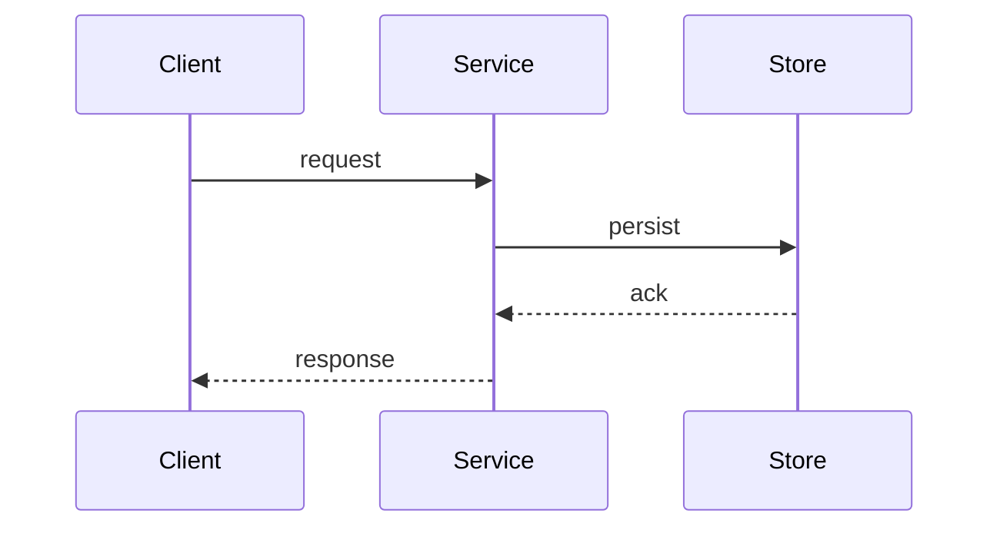

# System flow — Unique ID Generator

Replace this stub with the real request and write paths when you design the system.

## Happy path

## Write path

## Read path

TBD

## Failure / overload path

TBD — timeouts, retries, queues, degraded reads
