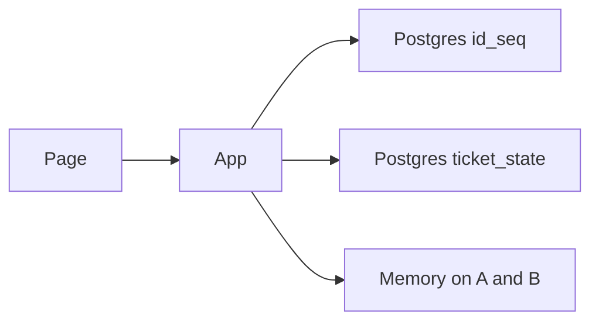
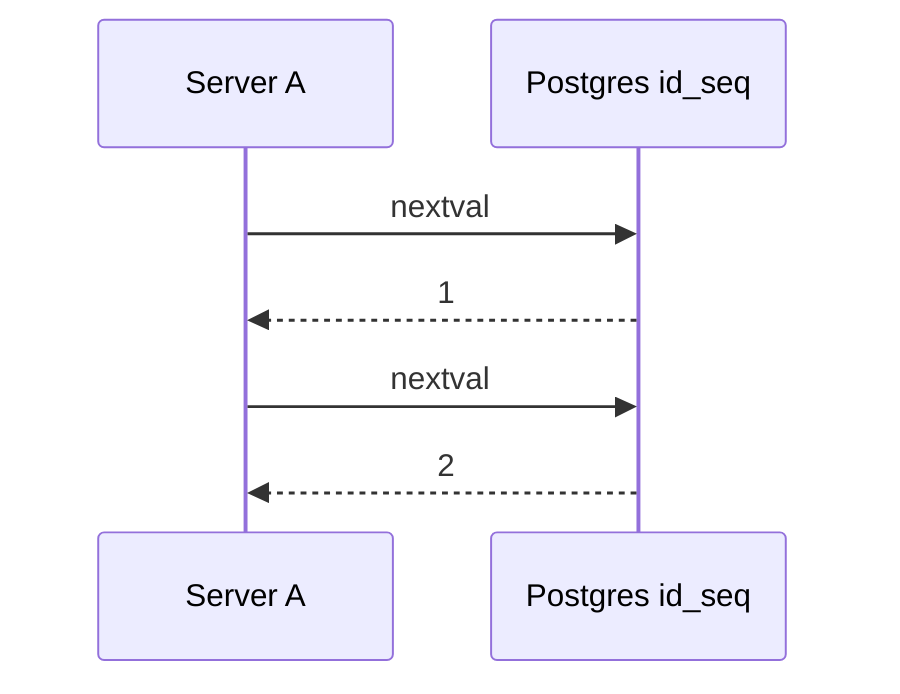
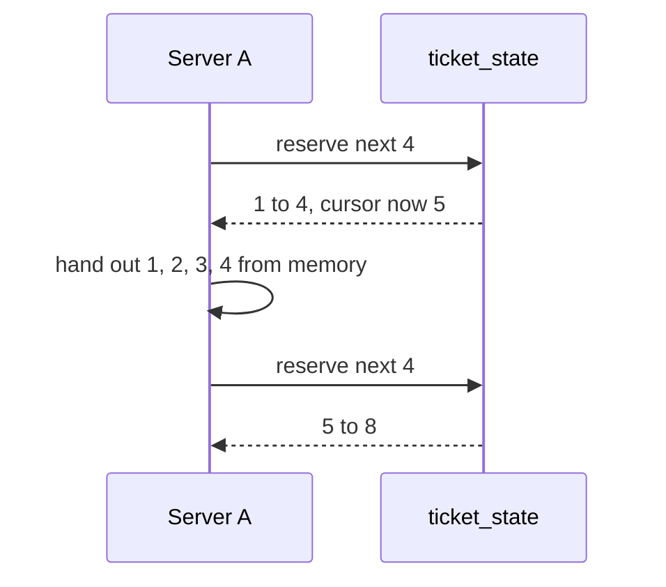

# System flow — Unique ID Generator

Each button calls `POST /api/generate` for servers A and B. The response lists the steps for every ID.

```mermaid
flowchart LR
  client[Page]
  api[App]
  seq[Postgres id_seq]
  tickets[Postgres ticket_state]
  mem[Memory on A and B]
  client --> api
  api --> seq
  api --> tickets
  api --> mem
```

## Counter

```mermaid
sequenceDiagram
  participant S as Server A
  participant P as Postgres id_seq
  S->>P: nextval
  P-->>S: 1
  S->>P: nextval
  P-->>S: 2
```

Server B continues at 3. One sequence, no gaps, one row for every ID.

## Ticket block

```mermaid
sequenceDiagram
  participant S as Server A
  participant P as ticket_state
  S->>P: reserve next 4
  P-->>S: 1 to 4, cursor now 5
  S->>S: hand out 1, 2, 3, 4 from memory
  S->>P: reserve next 4
  P-->>S: 5 to 8
```

## UUID version 4

The server draws 16 bytes, forces the version nibble to 4, forces the variant bits to 10, and formats the hex. Postgres is not involved.

## 64-bit ID

The server reads the clock, subtracts 2020-01-01, and packs that delta with its worker number and a per-millisecond sequence. Postgres is not involved. A second ID in the same millisecond increases the sequence by one.
