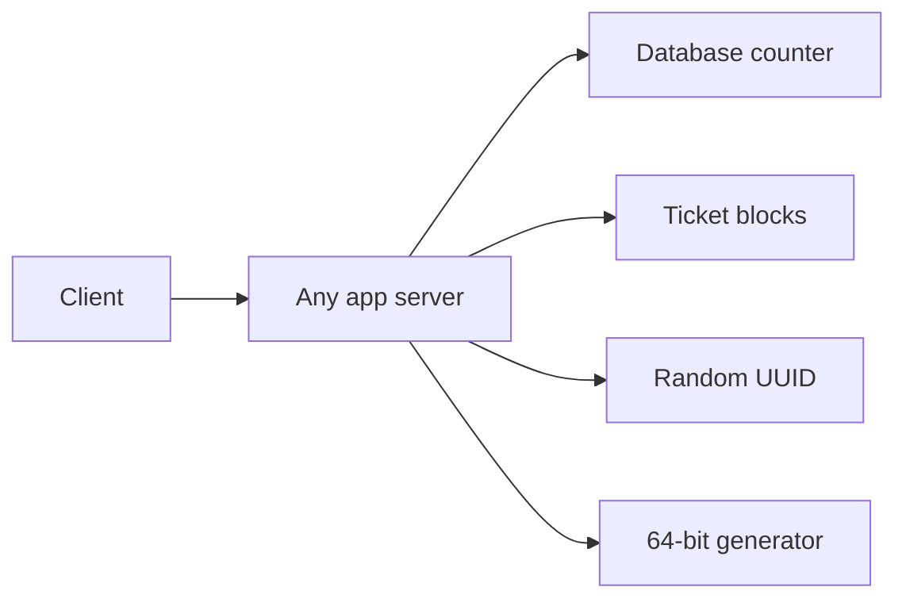

# Unique ID Generator

**Status:** Implemented  
**Sources:** Alex Xu Vol 1 Ch 7  
**Slug:** `unique-id-generator`

Practice in the five-step interview pattern. Keep notes original; link to Hello Interview / cite Alex Xu instead of copying write-ups.

## 1. Requirements and design scope

### Problem

Many app servers need to issue IDs at the same time. Two servers must not hand out the same ID. A newer ID should usually sort after an older one. This is Alex Xu Volume 1 Chapter 7. It is not the URL shortener’s base62 code, and it is not a user-signup flow.

### Functional requirements

- A caller asks for an ID and receives one 64-bit integer.
- The ID is unique across servers.
- IDs generated later usually sort after IDs generated earlier.
- A batch call can ask for several IDs at once. The single-ID call is the one we design.

### Non-functional requirements

The user’s rate, about **10,000 IDs per second**, is the number this chapter uses. One process can mint that many in memory, so a single database counter is enough at that rate and is still the wrong shape: every server would wait on one row, and that row’s death stops every ID.

| | Locked for this interview |
| --- | --- |
| Rate | 10,000 IDs/s. The design must keep working if that grows. |
| ID width | 64 bits. About 19 decimal digits. Eleven base62 characters would also hold it. Seven characters would not. |
| Ordering | Roughly by time. Not a gap-free sequence such as 1, 2, 3 across the whole cluster. |
| Latency | The ID is created in the server’s memory. No network call on the success path. |
| Failure | One dead app server stops only the IDs that server would have minted. Already issued IDs stay valid. |

Space check on the 7-character idea: 62^7 is about 3.5 trillion. At 10,000 IDs/s that space lasts on the order of ten years if every value is used exactly once. The chapter still uses 64 bits, because the ID embeds a timestamp and a machine number. Those fields do not pack into seven characters.

### Scope

- **In:** issuing the ID
- **Out:** account registration, login, and storing the tweet, order, or URL the ID points at. The shortener’s “code maps to a long URL” table is the other chapter.

### Core entities

| Entity | Description |
| --- | --- |
| ID | One 64-bit integer |
| Generator | The library inside an app server that builds the next ID |
| Worker number | A small integer that distinguishes this server from the others |

### APIs

```
POST /v1/ids          returns { "id": <64-bit integer> }
POST /v1/ids?n=100    returns a list of IDs
```

## 2. High-level design

The caller hits any app server. That server mints the ID. Four generators sit behind the same button so the lab can show what each one gives up. The interview answer is the 64-bit generator. The other three are there to make that choice visible.

| Generator | Where the next ID comes from | What the lab should show |
| --- | --- | --- |
| Database counter | One Postgres sequence. Every server asks it. | IDs are 1, 2, 3. Unique and strictly ordered. All servers share that one row. |
| Ticket ranges | One counter hands each server a block, such as 1–1000, then 1001–2000. | IDs stay ordered inside a block. A server mints from memory until the block runs out, then asks again. |
| Random UUID | Each server draws 128 random bits. No shared counter. | Unique in practice. Not sorted by time. |
| 64-bit time + worker + sequence | Each server builds the integer in memory. The worker number is different on each server. | Unique across servers. Roughly sorted by time. No database call per ID. This is the one we keep. |



A 7-character base62 string is the same idea as the database counter, with a different alphabet. The lab does not add it as a fifth generator. The URL shortener already did that encoding.

## 3. Low-level design and deep dive

The page at `http://localhost:8000` prints these same steps for servers A and B. The 64-bit generator is the one the interview keeps.

### Database counter

1. The server calls `nextval('id_seq')`.
2. Postgres adds one to a single sequence and returns it. Another server cannot be given that same value.
3. The integer is the ID. It has no timestamp and no worker number. The lab’s first run gives A the values 1, 2, 3 and B the values 4, 5, 6.

### Ticket ranges

Blocks are 4 integers wide so a short run can exhaust one.

1. If the server’s block is empty, it locks `ticket_state` and reserves the next four integers. The global cursor moves past that block.
2. The server stores the block in memory and hands IDs out locally.
3. When five IDs are requested, A receives 1–4, then a new block 5–8, and uses 5. B then receives 9–12. The unused 6, 7, and 8 stay with A. A crash of A drops them.

### Random UUID, version 4

1. Draw 16 random bytes.
2. Replace the high 4 bits of byte 6 with `0100`. The version is 4. In the text form that nibble is the first character of the third group, so the ID looks like `xxxxxxxx-xxxx-4xxx-....`.
3. Set the high 2 bits of byte 8 to `10`. That marks the RFC variant. Every other bit stays random.
4. Nothing in the ID is the clock or the worker. Sorting the strings does not sort by time.

### 64-bit time, worker, and sequence

The integer is 64 bits. The top bit stays 0 so the value is positive. The other bits are:

| Field | Bits | This lab |
| --- | --- | --- |
| Milliseconds since 2020-01-01 | 41 | From the server’s clock |
| Worker | 10 | A is 1, B is 2 |
| Sequence in that millisecond | 12 | 0 through 4095 |

1. Read the clock and subtract the epoch.
2. If this server’s previous ID used the same millisecond, add one to the sequence. If the sequence would pass 4095, wait for the next millisecond and start at 0.
3. A new millisecond sets the sequence back to 0.
4. Add the three shifted values. The code writes `(delta << 22) | (worker << 12) | sequence`. The shifts place time, server, and sequence in different bits, so that expression is the same number as the sum `(time × 2^22) + (server × 2^12) + sequence`. The decimal digits are the spelling of that sum. They are not pasted together from the three fields.

Server 0, sequence 0, in the demo millisecond:

```text
time      169163200000 × 4194304 = 709521886412800000
server    0 × 4096               =                  0
sequence  0                      =                  0
sum                                709521886412800000
```

That sum is 18 decimal digits. The largest ID is 19 digits, because the top bit stays 0.

Two servers in the same millisecond do not collide, because the worker bits differ. Two IDs from server A in that same millisecond differ by the sequence, so the second is exactly one greater. A clock that jumps backward stays at the last timestamp instead of minting an ID that would sort earlier and might repeat.

## 4. Component questions and special situations

The 64-bit generator is the one these cases apply to. The counter and the ticket path are included only where their failure is different.

### Clock moves backward

A central clock on the mint path would make every ID wait on the network again. Uniqueness for this generator lives in the process.

Each server remembers the timestamp of the last ID it issued. If the wall clock jumps backward, the next ID keeps that last timestamp and advances the sequence. The lab does this: a backward clock does not reuse an old `(timestamp, worker, sequence)` triple. The new ID still sorts after the previous ID from this same worker. It can sit ahead of the wall clock until the wall clock catches up.

Other options:

| Option | What it does | When it wins |
| --- | --- | --- |
| Trust the wall clock | The next ID uses the jumped-back time and sequence 0 | Never, for this design. The same worker can repeat an ID it already returned. |
| NTP only | Background sync so clocks stay close | Always, as hygiene. It does not stop one sudden step backward. |
| Central time service | Every ID, or every few milliseconds, asks one clock | When you can spend a network call. That spends the latency budget we locked. |
| Refuse until the wall clock catches up | The worker returns an error or blocks for those 5 seconds | When you would rather pause one worker than issue IDs whose timestamp is ahead of the wall clock. Twitter-style generators often do this. |
| Stay on the last timestamp | Keep minting with the last millisecond and the next sequence | This interview and this lab. One worker stays up. IDs stay unique. A 5-second jump means this worker’s timestamps run ahead of the wall until the wall catches up. |

NTP still runs in production so two workers’ clocks do not drift by minutes. It is not what prevents a duplicate.

### Two servers with the same worker number

If A and B are both worker 1 and both mint sequence 0 in the same millisecond, both pack the same integer. The caller cannot tell them apart.

The fix is to hand out worker numbers once, at process start, from a tiny lease table. Ten bits is 1024 slots, numbered 0 through 1023. Each row is one slot: who holds it, and when that hold ends. The table does not store IDs.

Where the sheet lives in production is a small choice, because it is 1024 rows and a write at process start, not a write per ID.

| Place | What you see | When it wins |
| --- | --- | --- |
| Config or a fixed map | A is 1, B is 2, written by an operator | A few hosts that rarely change. This is what the four generator buttons do. |
| Postgres table | 1024 rows, one locked at startup | Postgres is already running. This lab already has that database for the counter and the tickets. |
| DynamoDB table | The same 1024 rows, taken with a conditional write | An AWS system that does not want to run Postgres for this sheet. |
| ZooKeeper or etcd | One ephemeral entry per live process | The usual interview answer. The entry disappears when the process session dies, so the slot returns without a separate expiry sweep. |

This interview keeps the 1024-row lease. The lab builds that list in memory for the slot button. It does not add DynamoDB.

Worked example. The table starts empty. Host A starts and runs one transaction: lock the first free row, write `owner = A` and `expires_at = now + 30s` on slot 0, commit. From then on every ID A builds uses worker 0. That was one write. The next million IDs on A only read A’s clock and A’s sequence.

Host B starts a moment later and runs the same transaction. Slot 0 is owned by A and the lease is still in the future, so B skips it, locks slot 1, and writes `owner = B`. B’s IDs use worker 1.

Same millisecond, both at sequence 0, the packed integers differ in the worker bits:

- A packs `(delta << 22) | (0 << 12) | 0`
- B packs `(delta << 22) | (1 << 12) | 0`

Those two integers differ by 4096. A second process cannot also commit `owner = A’s slot` while the lease is valid, because the row lock lets only one transaction write that row.

Every 10 seconds the holder extends `expires_at`. Minting an ID does not touch the table. The lab skips this table and hard-codes A = 1 and B = 2.

| Option | What it does | When it wins |
| --- | --- | --- |
| Static config | An operator writes worker 1 on host A and worker 2 on host B | A handful of hosts that rarely change. A typo duplicates the number. |
| Lease table | Startup takes one free slot. The lease expires after the process is gone | This interview. 1024 rows, one write per process start. |
| Hash of the host name into 10 bits | No coordination | When a collision is acceptable to detect later. It is not acceptable here, because a collision is a duplicate ID. |

A dead process’s slot is reusable only after the lease has expired and that process can no longer be minting. Reusing worker 1 in the same millisecond it was last used can repeat a sequence number.

### 10× traffic

100,000 IDs/s does not change the bit layout. Twelve sequence bits allow 4096 IDs per millisecond per worker, about 4 million IDs/s on one worker if every millisecond is full. 100,000/s is about 100 IDs in a typical millisecond, under that cap.

A burst of more than 4096 IDs in one millisecond on one worker is the real limit. The lab bumps the timestamp by one millisecond and starts the sequence at 0. The caller waits out that millisecond. Adding app servers spreads the burst, and each new server needs its own worker number. The Postgres sequence stays off this path.

### One app server dies

Interview answer for the 64-bit generator: IDs already handed to callers stay valid, the other servers keep minting, and the dead server’s unused sequence numbers in the current millisecond become gaps.

Worked example. A holds worker slot 0. In millisecond T it has returned three IDs: sequence 0, 1, and 2. Then the process exits.

- Callers already stored those three integers. Nothing revokes them.
- Sequences 3 through 4095 for worker 0 in millisecond T are never created. Gaps are allowed. We did not promise 1, 2, 3 with no holes.
- B holds worker 1 and does not share a counter with A, so B’s next ID is minted on the next call.
- Slot 0 stays leased until the 30 seconds run out. A replacement process does not become worker 0 while A might still be alive on the far side of a network blip.
- After the lease ends, a new process may take slot 0. The clock is past T, so its first ID uses a later millisecond and sequence 0. It does not repeat A’s three IDs.

On the ticket path the waste is the rest of the block. A reserved 1–4, handed out 1 and 2, and died. 3 and 4 are never issued. The next server receives 5–8. That waste is acceptable. A block of 1000 wastes at most 999 integers.

The database counter wastes nothing. If the dead piece is Postgres, the counter and the ticket path both stop, and the 64-bit path keeps running.

### Region loss

All of the above assumes one region and worker numbers that are unique inside it. A second region needs its own range of worker numbers, or a datacenter field taken out of the 10 worker bits (5 + 5 is the usual split). This lab has one region and two fixed workers.

## 5. Summary and future improvements

- **What we designed:** A server adds `(time × 2^22) + (server × 2^12) + sequence`. The sign-up sheet gives each process its own server number, so two servers in the same millisecond stay apart. The sequence separates two IDs from the same server in that millisecond.
- **Main tradeoffs:** The ID is roughly ordered by time and has gaps. A shared Postgres counter would be gap-free and would put every ID on one row. A random UUID needs no sheet and does not sort by time.
- **Risks left on the table:** A dead server skips at most 4096 IDs in the crash millisecond, then its slot sits unused until the 30-second lease ends. Other servers keep minting. One region. A backward clock stays on the last timestamp, so that server’s IDs can run ahead of the wall clock.
- **With more time:** Discuss three generator topics. The bit budget is 41 time, 10 server, and 12 sequence; more than 4096 IDs in one millisecond on one server means shrinking one of the other fields. A second region splits the 10 server bits into 5 datacenter bits and 5 machine bits. If the sign-up sheet is down, servers that already hold a slot keep minting, and a new process waits. Signup may store a user under the returned integer. The user is not a field inside the 64 bits. A time-ordered ID in a URL can be guessed.

## Local implementation

The page explains the four generators and each button prints the steps for servers A and B.

- **Counter.** Postgres `id_seq`. A gets 1, 2, 3 and B gets 4, 5, 6 on a fresh sequence.
- **Tickets.** Blocks of 4 in Postgres, then memory. Five IDs on A use 1–5 and leave 6–8 in A’s block. B starts at 9.
- **UUID v4.** 16 random bytes, version nibble 4, variant bits `10`. The log shows the byte that was overwritten.
- **64-bit.** Epoch 2020-01-01, worker A=1 and B=2, sequence per millisecond. The log shows the pack formula and the decimal ID.
- **Situations on the same page.** A 5-second clock jump stays on the last timestamp. A lease table of 1024 slots gives A slot 0 and B slot 1, and refuses a second claim on slot 0. Filling sequence 4095 moves the next ID to the following millisecond. Stopping A leaves sequences 3–4095 as gaps, holds the slot for 30 seconds, and on the ticket path wastes 3 and 4 so the next server starts at 5. A simulated Postgres outage stops the counter and the tickets, and the 64-bit path still returns an ID.
- **Cut.** The lease table lives in the situation button, not in a separate coordination service. There is one region, no batch API beyond `count`, and the 7-character base62 counter is not a fifth button. The Postgres-down button does not stop the database container.

- Setup: `./scripts/setup.sh`
- Integration: `./scripts/run-scenarios.sh`
- Functional: `./scripts/run-functional.sh`

## Session notes

**2026-09-29**

**Q: IDs of length 7–11, a space of 62^7 to 62^11, about 10k IDs/s, and account registration out of scope?**  
A (user): that scope.

Taught: 10k/s is the chapter’s rate, and one process can do it, so the problem is many servers minting without one shared counter. A 7-character base62 space is large enough for a decade of sequential IDs and is the shortener’s code, not this ID. We lock a 64-bit integer, roughly time-ordered. Account registration and the object the ID names are out of scope.

**Q: The demo should compare different generators, not only the one we keep.**  
A (user): show them side by side.

Taught: four generators on one page. A Postgres sequence, ticket blocks, a random UUID, and a 64-bit time-plus-worker ID. The 64-bit ID is the interview answer. Base62 length 7 is not a fifth generator. The counter already covers a shared sequence, and the shortener covered that alphabet.

**Q: Explain in the README how each ID is generated, and show those steps in the UI.**  
A (user): that is the demo.

Taught: the README section “Low-level design” and the page list the same steps. Buttons run A and B. UUID v4 shows the version nibble being set to 4. The 64-bit button shows the clock, the worker, the sequence, and the packed integer.

**Q: Clock jumps backward, so use a central clock. Duplicate worker numbers go in a distributed key-value store. 100k IDs/s needs no change. A dead server can waste unused IDs.**  
A (user): that plan.

Taught: a central clock on each ID puts the network back on the success path. This server keeps its last timestamp and advances the sequence, which is what the lab already does. Worker numbers are a lease of 1024 slots at startup, not a store of every ID. 100,000/s is about 100 IDs in one millisecond, under the 4096 cap, so the bit layout stays. Already returned IDs stay valid. Tickets waste the rest of the block. The 64-bit path wastes only unused sequence numbers, and the other workers keep minting.

**2026-09-30**

**Q: How does a lease of 1024 slots stop two servers from sharing a worker number? And what is the actual answer when one app server dies?**  
A (user): the lease sentence and the death paragraph were not clear.

Taught: A locks slot 0 at startup and then mints locally with worker 0. B finds slot 0 held and takes slot 1. The row lock allows one owner. Same millisecond and sequence 0, the IDs differ by 4096. When A dies after issuing sequence 0, 1, and 2 in millisecond T, those three IDs stay valid, sequences 3–4095 are gaps, and B keeps minting. Slot 0 waits out the lease before anyone else may use worker 0.

**Q: Cover those cases in the demo so the numbers are visible.**  
A (user): the page should show them.

Taught: five situation buttons replay a fixed millisecond. Clock jump, slot lease, a full sequence of 4096, server A dying (64-bit gaps and wasted tickets 3 and 4), and Postgres not answering. The four generator buttons are unchanged. The lease table is in-process for the button. The database container stays up during the simulated outage.

**Q: The ID is time plus server plus sequence, with a sign-up table so it stays unique. We accept losing about 30 seconds of IDs when a server dies. Later, user signup can use this as the user ID.**  
A (user): that recap.

Taught: the ID is the sum `(time × 2^22) + (server × 2^12) + sequence`. The sheet separates servers. The sequence separates two IDs from the same server in one millisecond. A death skips at most 4096 numbers in that millisecond and then leaves one slot idle for the rest of the lease. Other servers keep minting. Signup may store a user under an ID this generator returns. The user is not a field in the 64 bits. With more time we split server bits for a second region and put the sheet in Postgres or ZooKeeper/etcd.

## Interview checklist

- [x] 1. Requirements, numbers, and scope stated out loud
- [x] 2. High-level design that actually works end-to-end
- [x] 3. Low-level / deep dive with tradeoffs
- [x] 4. Component probes and special situations (traffic, rush hour)
- [x] 5. Summary and future improvements
- [x] FAQ practiced out loud
