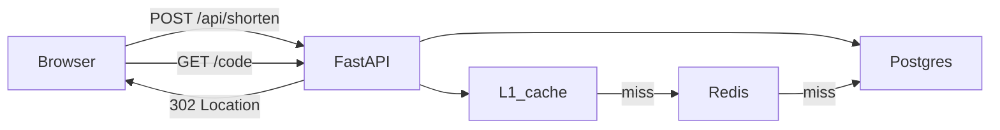
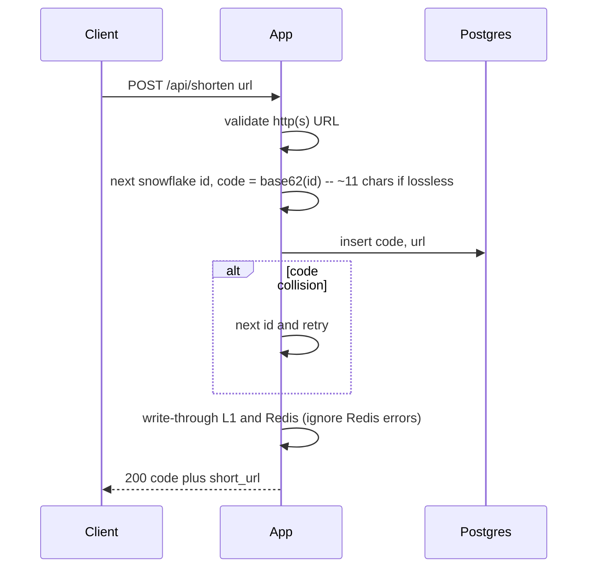
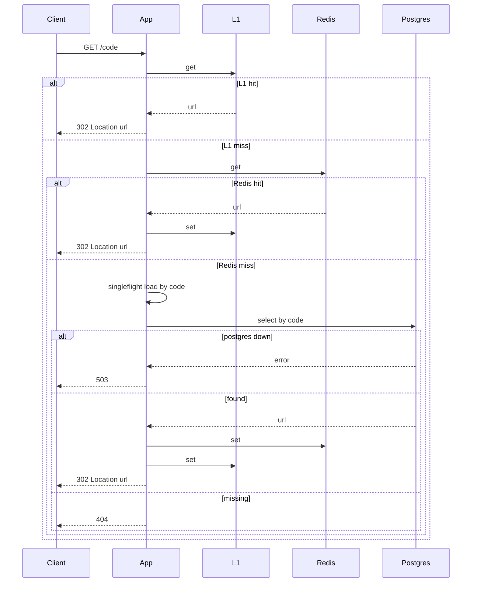

# System flow — URL Shortener

## Happy path

## Write path

## Read path

## Failure / overload path

- Postgres down: create → 503; redirect cache hit → 302; redirect cache miss → **503** (not 404).
- Redis down: create still 200 if Postgres is up (write-through skipped); redirect uses L1 then Postgres.
- Hot key / 10× redirects: serve from L1/Redis; **one DB fill per code** via singleflight on miss.
