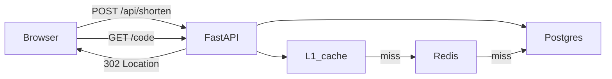
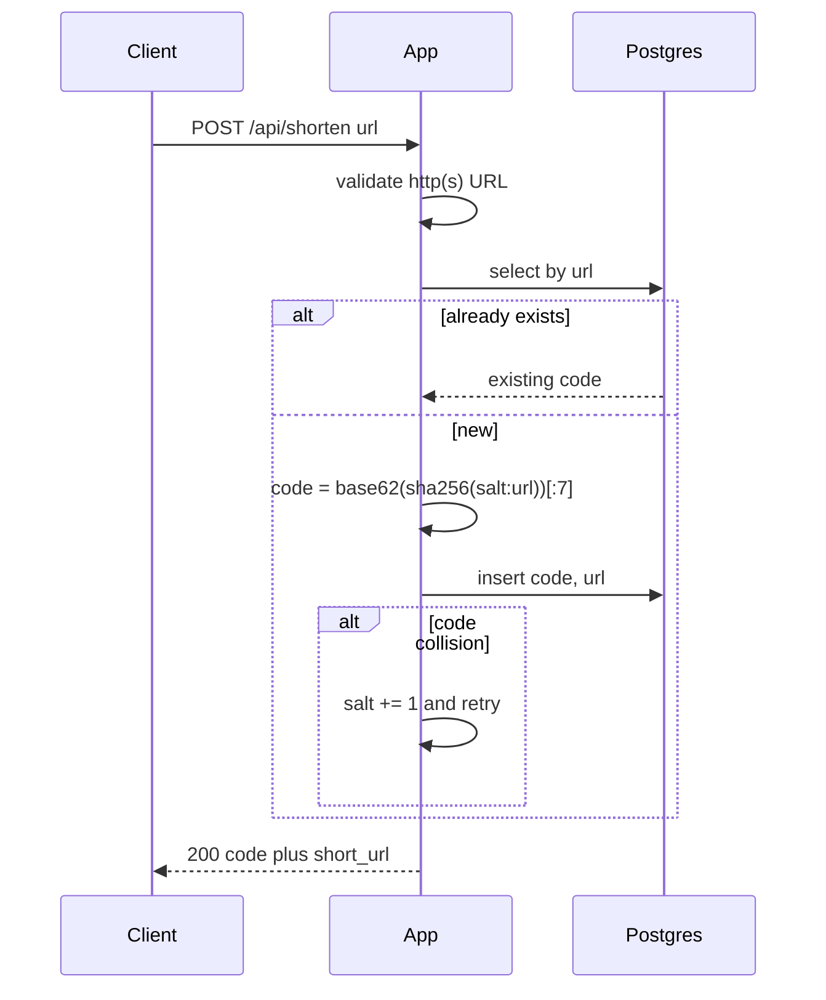
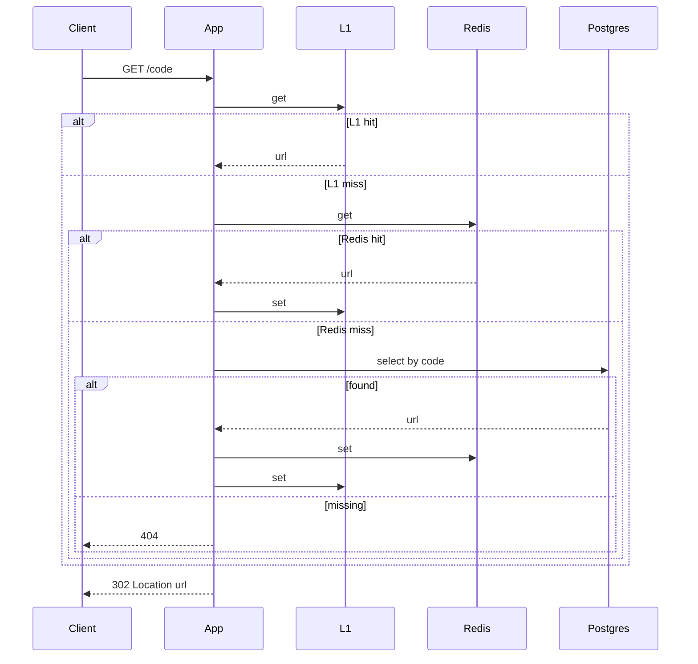

# System flow — URL Shortener

## Happy path

## Write path

## Read path

## Failure / overload path

- Postgres down: create → 503; redirect cache hit → 302; redirect cache miss → 503.
- Redis down: create unchanged; redirect uses Postgres.
- Hot key / 10× redirects: serve from L1/Redis; one DB fill on miss.
