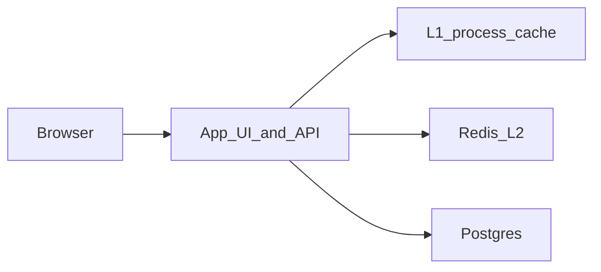

# URL Shortener

**Status:** Implemented  
**Sources:** Hello Interview (Bitly); Alex Xu Vol 1 Ch 8  
**Slug:** `url-shortener`

Practice notes from an interview-style session. Original notes; not a copy of those write-ups.

## 1. Requirements and design scope

### Problem

Design a URL shortener (like Bitly): turn a long URL into a short alias, redirect on visit, and handle high read traffic.

### Functional requirements

- [x] Create: submit a long URL, get back a unique short URL
- [x] Redirect: `GET` on the short URL returns **302** to the original
- [x] Lookup: resolve `code` → long URL (what redirect uses)

### Non-functional requirements

- [x] Read-heavy (many more redirects than creates)
- [x] Redirect latency: tens of ms in the common case (cache hit locally)
- [x] Availability over create-time consistency (a new link may lag in cache)
- [x] Interview scale ballpark: 100M new URLs/month, 10B redirects/month — **local impl is a tiny teaching subset**

### Scope

- **In:** create, persist mapping, redirect, simple UI, cache on the read path
- **Out (this interview):** custom aliases, analytics, expiry, user accounts, 301, multi-region

### Core entities

| Entity | Description |
| --- | --- |
| Link | Mapping from short `code` (PK) to long `url` |

### APIs

```
POST  /api/shorten     { "url": "https://..." } → { "code", "short_url" }
GET   /{code}          302 Location: original URL
GET   /                UI to paste a URL
GET   /healthz         liveness (app + postgres)
```

## 2. High-level design



**Create:** validate URL → hash to a 7-char code (rehash on collision) → insert Postgres → return short URL.

**Redirect:** L1 → Redis → Postgres → 302. Fill caches on miss.

## 3. Low-level design and deep dive

### Data model

```
links (
  code       VARCHAR(16) PRIMARY KEY,
  url        TEXT NOT NULL UNIQUE,
  created_at TIMESTAMPTZ NOT NULL DEFAULT NOW()
)
```

`code` is the key, not the full `https://host/{code}` (host is config). Unique `url` makes create idempotent: same long URL → same code.

### Deep dives

1. **Codes:** SHA-256 of `salt:url`, base62, 7 chars. On `code` collision, increment salt and rehash. Same URL is not a collision — we return the existing row.
2. **302 vs 301:** 301 is cached by browsers (clicks may never hit us). 302 keeps control; we use **302**.
3. **Bottleneck:** the redirect **read** path. PK lookup is cheap; at high QPS add cache so most redirects skip Postgres. Writes are not the first limit.

## 4. Component questions and special situations

### Specific components

- **Postgres down:** create returns **503**. Redirect: **cache hit → 302**; **cache miss → 503** (not 404 — the link may exist).
- **Redis down:** create still works (Postgres). Redirect falls through to Postgres (slower, still correct).

### Special situations

- **10× redirects:** cache the read path first (L1 in-process + Redis). More API boxes without a cache still stampede Postgres, especially on a few URLs.
- **Rush hour / spike:** same — cache, then scale app for connections/CPU.
- **Hot key (Reddit):** put that code in cache (shared Redis so every instance hits one key). Also avoid thundering herd: one DB fetch fills the cache. A single Redis string is cheap; the failure mode is stampedes to Postgres, not Redis capacity.
- **Region or dependency loss:** local version is one region. Future: replicate mappings, serve redirects from cache/replicas.

## 5. Summary and future improvements

- **What we designed:** hash-based short codes, Postgres source of truth, 302 redirects, L1 + Redis on reads.
- **Main tradeoffs:** 302 vs 301; hash (idempotent per URL) vs unique ID (many shorts to one URL); cache freshness vs redirect latency.
- **Risks left on the table:** no analytics, no TTL, single region, hash cannot give two aliases for one URL.
- **With more time:** custom aliases, click counts, CDN for ultra-hot 302s, ID-generation codes.

## Local implementation

Simplified but working: UI + FastAPI + Postgres + Redis.

**Cut vs a full interview design:** no CDN, no sharding, no custom aliases, one app replica. Cache + 302 + hash codes are included.

```bash
cd questions/url-shortener
./scripts/setup.sh
./scripts/run-scenarios.sh
./scripts/run-functional.sh
```

Open http://localhost:8000 — paste a URL, click the short link, confirm redirect.

- Setup: `./scripts/setup.sh`
- Integration: `./scripts/run-scenarios.sh`
- Functional: `./scripts/run-functional.sh`

## Interview checklist

- [x] 1. Requirements, numbers, and scope stated out loud
- [x] 2. High-level design that actually works end-to-end
- [x] 3. Low-level / deep dive with tradeoffs
- [x] 4. Component probes and special situations (traffic, rush hour)
- [x] 5. Summary and future improvements
- [ ] FAQ practiced out loud
