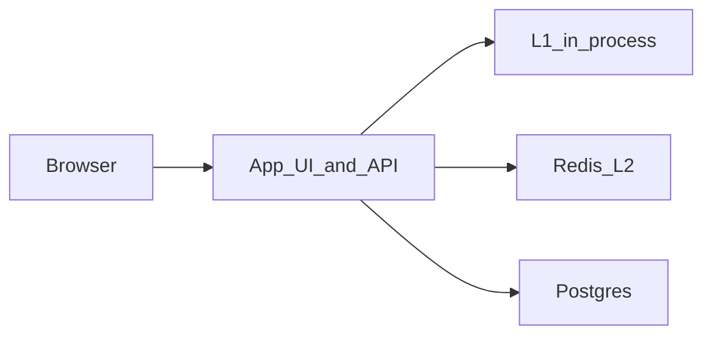

# URL Shortener

**Status:** Implemented  
**Sources:** Hello Interview (Bitly); Alex Xu Vol 1 Ch 8  
**Slug:** `url-shortener`

Practice notes from an interview-style session. Original notes; not a copy of those write-ups.

## 1. Requirements and design scope

Updated in re-practice (2026-09-13).

### Problem

A service that **accepts a long URL and returns a short URL**, and later **sends the user to the long URL** when they open the short one. Two operations: **write** the mapping, **read** the mapping (in the product, the read is an HTTP redirect, not a JSON body).

### Functional requirements

- [x] **Must:** `POST` create — mint a **new unique short code** and store `code → long URL`
- [x] **Must:** read path — given the short URL, resolve the long URL and **redirect** the client
- [x] **Must:** short **codes** are unique (the long URL is **not** unique: same destination may have many shorts)
- [x] **Must:** every create gets a **new** short URL — two people, or the same person twice, do not share a code (we do **not** have accounts, so “person” = each POST)
- [ ] **Nice-to-have:** mapping **TTL**

### Non-functional requirements

- [x] **Read-heavy.** Treat **~10,000 QPS as redirect traffic** (creates are far fewer). If 10k were creates, the store and ID generator would be a different problem.
- [x] **High availability** on the redirect path (a user clicking a link should usually succeed)
- [x] **Low redirect latency** (aim: cache hit in a few milliseconds; miss still tens of ms)
- [x] Uniqueness is on **`code` only**. Duplicate long URLs are allowed and expected.
- [x] For creates: better to fail than to mint a **duplicate code**. For redirects: prefer a slightly stale cache hit over failing if the DB is briefly down

### Scope

- **In:** create mapping, unique codes minted by the **system**, redirect, simple UI, cache on reads (needed to talk about 10k QPS)
- **Out of this interview:** user accounts / auth, click analytics / dashboards, **user-defined / custom short URLs** (no `POST { url, code: "my-launch" }`)
- **Deferred (nice-to-have):** TTL/expiry; 301 vs 302 is a later deep-dive, not a product requirement yet

### Core entities

| Entity | Description |
| --- | --- |
| Link | One row per short `code` (PK). `url` is **not** unique. Optional `expires_at` if we add TTL. |

### APIs

```
POST  /api/shorten     { "url": "https://..." } → { "code", "short_url" }
GET   /{code}          302 Location: original URL   (the "read")
GET   /                UI
GET   /healthz
```

## 2. High-level design

Updated in re-practice (2026-09-13).



**Create (write):** validate long URL → mint a **monotonic ID** and encode **base62** as `code` → `INSERT` into Postgres (`code` PK). On unique conflict, mint again. Do **not** look up by long URL. Return `short_url`. Optionally **write-through** L2 so the first click is a cache hit.

**Redirect (read):** `GET /{code}` → **L1 → Redis → Postgres** (cache-aside). On hit/miss-fill, **302** to the long URL. Local L1 is an in-process LRU (Caffeine if this were Java; we use a small dict/LRU in Python).

**Store (logical, not full schema yet):** one table keyed by **`code`** (the unique token, not `https://host/code`). Columns we care about: `code`, `url`, `created_at`. `expires_at` is optional (TTL nice-to-have). `updated_at` is optional; we do not expose edit/custom alias.

**Not in this high-level picture:** user-defined codes, auth, analytics, CDN (a later scale option).

## 3. Low-level design and deep dive

Updated in re-practice (2026-09-13).

### Data model

```
links (
  code       VARCHAR(16) PRIMARY KEY,  -- base62(snowflake id), ~11 chars if we do not truncate
  url        TEXT NOT NULL,            -- NOT unique; many codes → one destination
  created_at TIMESTAMPTZ NOT NULL DEFAULT NOW(),
  updated_at TIMESTAMPTZ NOT NULL DEFAULT NOW(),  -- unused for now; no edit API
  expires_at TIMESTAMPTZ NULL                 -- unused for now; NULL = never expire
)
```

Redirect today: ignore `expires_at`. If we turn TTL on later: `expires_at IS NOT NULL AND expires_at < now()` → 404/410, do not cache as a live mapping.

### Deep dives

1. **IDs:** Snowflake-style 64-bit id (time + worker + sequence), then **base62**. A **full** 64-bit value needs **~11 base62 chars**, not 7 (`62^7 ≈ 3.5e12` but `2^64 ≈ 1.8e19`). Truncating to 7 chars can collide even when Snowflake ids are unique — keep INSERT-retry. Local: one-worker Snowflake (no real cluster).
2. **302 vs 301:** **302**. 301 is cached by browsers; later clicks may never hit us; we could not change TTL/destination. 302 costs more origin QPS (acceptable; we already cache).
3. **Hot key / first miss:** Steady state is L1/L2. The danger is a **thundering herd**: thousands of concurrent misses **before** the first `SET` finishes. “It will fill pretty quick” is true for one request, not for 10k in the same millisecond. Need **singleflight** (one DB load per `code` per process, or a Redis lock).

### Code length — locked choice

Prefer **~11 character** codes so Snowflake uniqueness is preserved. 7 characters is enough *count* of links, not enough to *encode* a 64-bit id. Collision retry remains as safety.

## 4. Component questions and special situations

Updated in re-practice (2026-09-13).

### Specific components

- **Postgres down:** create → **503** (UI can show unavailable). Redirect: **cache hit → 302**; **cache miss → 503, not 404** (404 means “code does not exist”; we do not know).
- **Redis down:** **create still succeeds** (Snowflake + Postgres). Redirect: L1 then Postgres. Optional **rate-limit / shed** redirects so Postgres is not melted. Do not fail creates because Redis is dead.

### Special situations

- **10× redirects (~100k QPS):** singleflight assumed. Do not only add app replicas first if misses still hit one primary. Order: keep **L2 hit rate** (Redis size/cluster) → more **app** boxes for 302/CPU → Postgres **replicas** for remaining misses → **CDN** if still hot. Local: one Redis, one PG.
- **Hot key:** L1+L2 + singleflight (Redis lock across boxes).
- **Snowflake clock skew:** not “nothing breaks because it is distributed.” Clock **backward** can reuse (time, worker, seq) → duplicate id. **UNIQUE(code) + retry** preserves uniqueness. Time-ordering of ids can be wrong; use `created_at`. Forward jumps mostly leave gaps.

## 5. Summary and future improvements

Locked in re-practice (2026-09-13). User asked to implement this recap rather than re-answer Step 5 live.

- **What we designed:** every `POST` mints a **Snowflake-style 64-bit id**, **lossless base62 (~11 chars)**, `INSERT` with `code` PK (retry on unique violation). Same long URL → many shorts. Redirect is **L1 → Redis → Postgres → 302**, with **singleflight** on a hot miss. Optional **write-through** to cache on create. Postgres is source of truth.
- **Main tradeoffs accepted:** **302** over 301 (we keep control of later clicks). **Unique IDs** over hash/idempotent (no accounts, so each POST is a new alias). **~11 chars** over 7-char truncation of Snowflake (7 chars only if we shrink the id space). Cache-aside for 10k redirect QPS: freshness vs a few-ms hit.
- **Risks left:** TTL columns unused; no analytics; single region / one Redis / one PG; Redis down can pile onto Postgres (shed in production); Snowflake clock skew can reuse ids — **UNIQUE(code)+retry** is the real uniqueness guarantee; L1 is per process.
- **With more time:** enforce TTL, custom aliases, click counts, Redis cluster + CDN for 100k QPS, PG read replicas, multi-worker Snowflake ids, Redis lock across boxes.

## 6. What we implemented

Re-practice (2026-09-13) replaced the hash/idempotent local app.

- **Runs:** HTML UI on port 8000, FastAPI, Postgres (`links`: `code` PK, `url` not unique, `created_at` / `updated_at` / `expires_at`), Redis plus in-process L1 LRU. Creates mint Snowflake → 11-char base62; redirects are 302. Singleflight coalesces concurrent DB loads of the same `code`. Redis errors are ignored on write-through so create still succeeds.
- **Matches the design:** new code every POST; uniqueness on `code` only; cache-aside L1→Redis→PG; 503 if Postgres is down on create or on redirect miss (404 only when PG said “no row”); 302 not 301.
- **Cut:** CDN, sharding, custom aliases, analytics, TTL enforcement, Redis cluster, PG replicas, cross-process Redis lock, extra redirect rate-limiting when Redis is down.
- **How to run:** `cd questions/url-shortener && ./scripts/setup.sh && ./scripts/run-scenarios.sh && ./scripts/run-functional.sh` then open http://localhost:8000. Stop with `./scripts/stop.sh`.
- **Tests prove:** health, create+redirect with 11-char codes, invalid URL, unknown code 404, same URL → **different** codes, concurrent same URL → **distinct** codes, UI HTML served.
- **Session questions:** 2026-09-13 — singleflight + hot key; 7 vs 11 char codes vs Bitly/Hello Interview; where in `src/main.py` the generator, INSERT, singleflight, L1, and Redis live (see `FAQ.md`). No further questions; session closed.

## Local implementation

Simplified but working: UI + FastAPI + Postgres + Redis.

**Cut vs a full interview design:** no CDN, no sharding, no custom aliases, one app replica / one Snowflake worker. Cache + 302 + Snowflake codes + singleflight are included. TTL columns exist but are unused.

```bash
cd questions/url-shortener
./scripts/setup.sh
./scripts/run-scenarios.sh
./scripts/run-functional.sh
./scripts/stop.sh
```

Open http://localhost:8000 — paste a URL, click the short link, confirm redirect.

- Setup: `./scripts/setup.sh`
- Integration: `./scripts/run-scenarios.sh`
- Functional: `./scripts/run-functional.sh`
- Stop: `./scripts/stop.sh`

## Interview checklist

- [x] 1. Requirements, numbers, and scope stated out loud
- [x] 2. High-level design that actually works end-to-end
- [x] 3. Low-level / deep dive with tradeoffs
- [x] 4. Component probes and special situations (traffic, rush hour)
- [x] 5. Summary and future improvements
- [x] 6. What we implemented (after tests)
- [x] 7. User questions at the end, recorded in FAQ/README
- [x] 8. Stack stopped with `./scripts/stop.sh`
- [ ] FAQ practiced out loud
