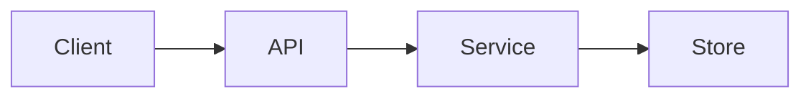

# Web Crawler

**Status:** Stub  
**Sources:** Hello Interview; Alex Xu Vol 1 Ch 9  
**Slug:** `web-crawler`

Practice in the five-step interview pattern. Keep notes original; link to Hello Interview / cite Alex Xu instead of copying write-ups.

## 1. Requirements and design scope

### Problem

Design a web crawler: discover URLs, fetch pages politely, extract links, and store content without overwhelming targets.

### Functional requirements

- [ ] TBD — gather with the interviewer (or from the prompt)

### Non-functional requirements

- [ ] Scale (QPS, DAU, storage) — put numbers here
- [ ] Latency targets
- [ ] Consistency / availability tradeoff
- [ ] Durability / failure handling

### Scope

- **In:** TBD
- **Out (this interview):** TBD

### Core entities

| Entity | Description |
| --- | --- |
| TBD | |

### APIs

Sketch 4–5 endpoints, then move on.

```
POST   /v1/...
GET    /v1/...
```

## 2. High-level design

Summarize the request path and the main stores. Details belong in [FLOW.md](FLOW.md) and [COMPONENTS.md](COMPONENTS.md).



## 3. Low-level design and deep dive

### Data model

Tables / keys / partitions for the hot paths.

### Deep dives

The interesting internals of *this* problem (the ones an interviewer will probe):

1. TBD
2. TBD
3. TBD

## 4. Component questions and special situations

### Specific components

What happens if this piece fails, is slow, or is wrong? Point at [COMPONENTS.md](COMPONENTS.md).

- TBD component: TBD failure / consistency question

### Special situations

- **10x traffic:** TBD
- **Rush hour / spike:** TBD
- **Hot key or hotspot:** TBD
- **Region or dependency loss:** TBD

## 5. Summary and future improvements

- **What we designed:** TBD
- **Main tradeoffs:** TBD
- **Risks left on the table:** TBD
- **With more time:** TBD

## Local implementation

Not implemented yet.

- Setup: `./scripts/setup.sh`
- Integration: `./scripts/run-scenarios.sh`
- Functional: `./scripts/run-functional.sh`

## Interview checklist

- [ ] 1. Requirements, numbers, and scope stated out loud
- [ ] 2. High-level design that actually works end-to-end
- [ ] 3. Low-level / deep dive with tradeoffs
- [ ] 4. Component probes and special situations (traffic, rush hour)
- [ ] 5. Summary and future improvements
- [ ] FAQ practiced out loud
